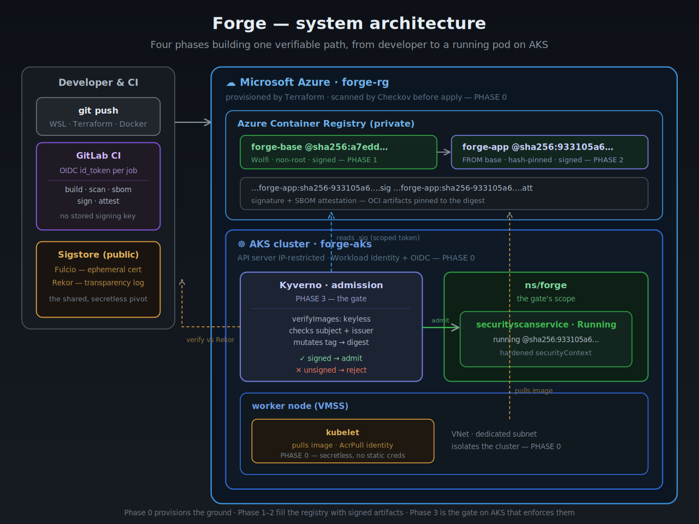
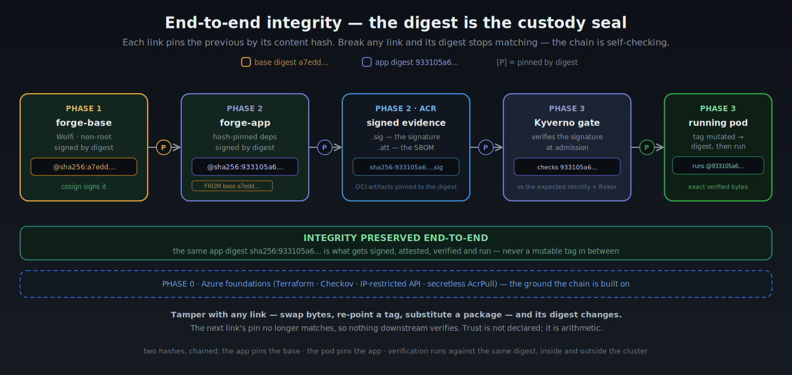
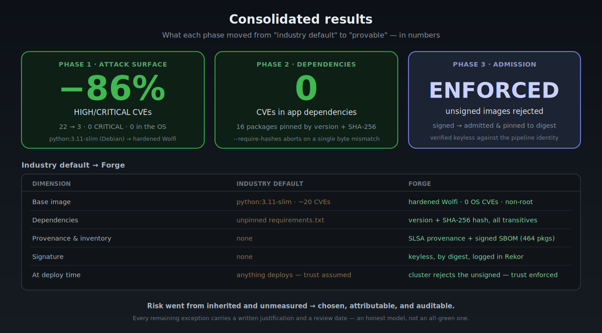

<!-- Save as README.md at the root of the forge/ repo -->

# 🛡️ Forge — Secure Software Supply Chain on Azure

> **Can I prove that what runs in my cluster is exactly what I built — hardened, auditable, and untampered?**
> The industry default answer is *"we trust so."* This project's answer is **"I can prove it"** — cryptographically, for every build, with no human in the loop.

A four-phase DevSecOps project that builds a **complete, verifiable software supply chain** on Azure: from Infrastructure-as-Code foundations, through a hardened signed base image and a signed application, to a Kubernetes **admission gate where the cluster itself refuses to run anything the pipeline didn't sign.**

---

## Objectives

What this lab set out to prove, end to end:

- 🏗️ **Provision cloud infrastructure as code**, security-scanned *before* it exists — no click-ops, no drift, no secrets in state.
- 🔒 **Harden the base image once, centrally**, and cut inherited attack surface — the *golden base* pattern every app inherits from.
- 📦 **Make the application's supply chain verifiable** — dependencies pinned by hash, a signed inventory (SBOM), and build provenance.
- ✍️ **Sign every artifact without managing a key** — keyless signing, where the pipeline's own ephemeral identity is the credential.
- 🚦 **Enforce it at deploy time** — a cluster that actively *rejects* any image not signed by the expected pipeline identity, not one that merely hopes it was.
- 📋 **Document the trade-offs honestly** — every accepted risk written down with its rationale, not silenced.

---

## System architecture

Four phases building one verifiable path — from a developer's `git push` to a running pod on AKS, over real Azure infrastructure.



- **Phase 0** provisions the ground (VNet · AKS · ACR · Workload Identity).
- **Phases 1–2** fill the registry with signed artifacts (the base, then the app built on it).
- **Phase 3** is the gate on AKS that enforces those signatures before a pod is scheduled.

---

## The chain of custody, end to end

The heart of the project: integrity is not a single check but a **chain of digests**, where every link cryptographically pins the one before it. The same app digest is what gets signed, attested, verified and run — a mutable tag never carries the trust in between.



**Break any link — swap bytes, re-point a tag, substitute a package — and its digest changes, so the next link's pin no longer matches and nothing downstream verifies. Trust is not declared; it is arithmetic.**

---

## The four phases

| | Phase | Question it answers | Headline result | Detail |
|:-:|:--|:--|:--|:--|
| **0** | **Foundations** | Is the infrastructure correct and secure from the start? | IaC scanned *before* apply · secretless auth · IP-restricted API | [`phase-0-infra/`](./phase-0-infra) |
| **1** | **Hardened base** | Is the base image the one I built, untampered? | **22 → 3 HIGH/CRITICAL CVEs (−86%), 0 in the OS** | [`phase-1-images/`](./phase-1-images) |
| **2** | **Supply chain** | Is the app exactly what I built, from a known base? | **16 deps pinned by version + SHA-256 hash, 0 CVEs** | [`phase-2-app/`](./phase-2-app) |
| **3** | **Admission gate** | Does my platform *require* all of the above? | Cluster **rejects unsigned images at deploy time** | [phase 3 →](./phase-2-app/docs/phase3-admission-gate.md) |

Each phase has its own detailed README. Read top to bottom — the project is linear and cumulative. *(Phase 3 lives inside `phase-2-app/`, since the admission gate governs that app's own image.)*

---

## The three ideas it rests on

**🔑 The signature belongs to a *process*, not a *person*.**
The signer is the pipeline itself (`gitlab-ci.yml@refs/heads/main`), not a human with a key on a laptop. Keyless signing (OIDC → Fulcio → Rekor) means there is **no long-lived key to store, rotate, or leak** — the ephemeral build identity *is* the credential.

**🔗 Rekor is the pivot.**
The pipeline signs in one place; the cluster verifies in another; **they never exchange a secret** — only a public, immutable, auditable fact travels between them. That is what decouples build-time from deploy-time without either side custodying anything.

**⚡ Passive evidence → active control.**
Phases 0–2 *produce* proof (Trivy, SBOM, signature) — but none of them *prevents* anything. Phase 3 is the link that **exercises** the evidence: verification stops being a step someone remembers and becomes the platform's default. The difference between *"I have a signature"* and *"my platform requires one."*

---

## Consolidated results

What each phase moved from "industry default" to "provable" — in numbers.



Risk went from *inherited and unmeasured* to **chosen, attributable, and auditable** — and every remaining exception carries a written justification and a review date.

---

## A CVE that turned fixable after the build — and turned the gate red

Phase 2 documented a known trade-off: pinning the base by digest protects against image substitution — but it also freezes you on a fixed version of everything inside it. A week later, that note stopped being theoretical.

- 🛡️ **The gate was set to `--ignore-unfixed`** — block only vulnerabilities that *have* a patch, since a flaw with no available fix isn't actionable.
- ✅ **On build day it passed, correctly** — the base image's Python carried a HIGH CVE with no upstream fix yet, so the gate let it through.
- 🔴 **A week later, the same bytes turned red** — a patched version of the base image's Python was released, so the finding flipped from *unfixable* to *actionable*, and the exception no longer applied.
- 🔧 **Fixed at the source, not silenced** — rebuild the base so it pulls the patched Python, then point the app at that rebuilt base by its new digest. No `.trivyignore` entry: a patch existed now, and *fix comes before except*.

> **The pin that guarantees integrity is the same pin that holds you on yesterday's packages.** Same bytes, a week apart, opposite verdicts — writing down what you *didn't* fix is how you recognise it when it bites. → [Full incident in Phase 3](./phase-2-app/docs/phase3-admission-gate.md)

---

## Lessons learned

What an extended, end-to-end lab teaches that a single demo can't:

- **A green scan is a photograph, not a contract.** It certifies the world on scan day, against that day's vulnerability database. Build-time gates can't catch a CVE disclosed later — production needs *continuous* re-scanning of deployed artifacts.
- **The best secret is one that doesn't exist.** Keyless signing and Workload Identity remove the long-lived credential entirely. This lab hit *three* expired- or desynced-credential incidents — every one of them an argument against storing secrets in the first place.
- **Least privilege doesn't prevent leaks — it caps their cost.** A scoped, read-only token leaked in a CLI log; the blast radius was one repository for seven days, instead of the whole subscription.
- **Documenting residual risk is predicting it.** The Phase 2 note about manual digest pinning named the exact failure mode that then occurred. Honesty about what you *didn't* fix is a control, not a confession.
- **Diagnose before you patch.** Every pipeline failure was resolved by root cause — distinguishing a configuration error (fixed in the file) from a transient infrastructure failure (made resilient), and treating the runbook as intent, not script.
- **Verification is what turns evidence into a control.** Signing, scanning and SBOMs are all passive until something *checks* them at the point of deployment. The gate is the difference between having proof and enforcing it.

---

## Tech stack

**Cloud & orchestration** — Azure (AKS · ACR · VNet) · Kubernetes
**IaC & policy** — Terraform · Checkov · Kyverno
**Supply chain** — Chainguard Wolfi · Docker Buildx (SLSA provenance) · Trivy · Syft (SBOM) · cosign / Sigstore (Fulcio + Rekor)
**Dependency integrity** — pip-tools (`--generate-hashes`)
**CI/CD & identity** — GitLab CI · OIDC · Workload Identity

## Repository map

```text
forge/
├── phase-0-infra/     Terraform foundations (AKS · ACR · VNet · Workload Identity)
├── phase-1-images/    Hardened signed golden base (Wolfi · Trivy · cosign)
├── phase-2-app/       Signed application supply chain
│   └── docs/phase3-admission-gate.md   ← Phase 3: Kyverno admission gate
└── docs/img/          Figures for this overview
```

## Status

| Phase | State |
|:--|:--|
| 0 · Foundations | ✅ Complete |
| 1 · Hardened base | ✅ Complete |
| 2 · Supply chain | ✅ Complete |
| 3 · Admission gate | ✅ Complete |

---

*Platform Security Engineering · a portfolio about proving, not trusting.*
