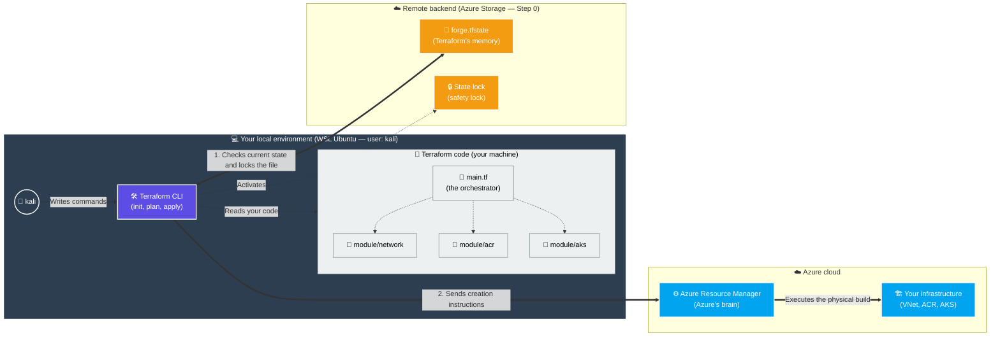
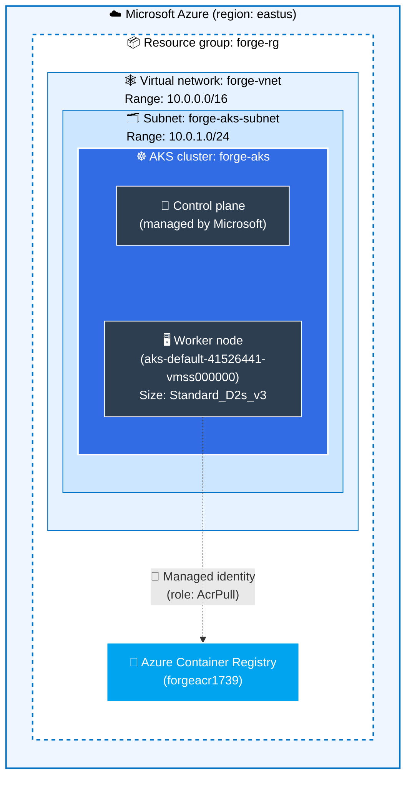
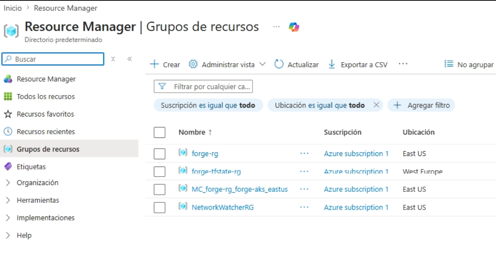
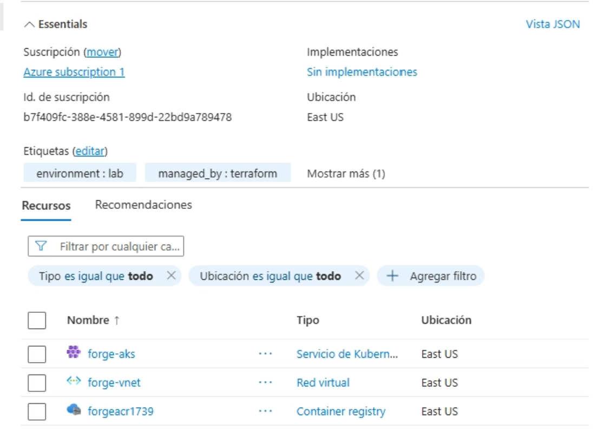
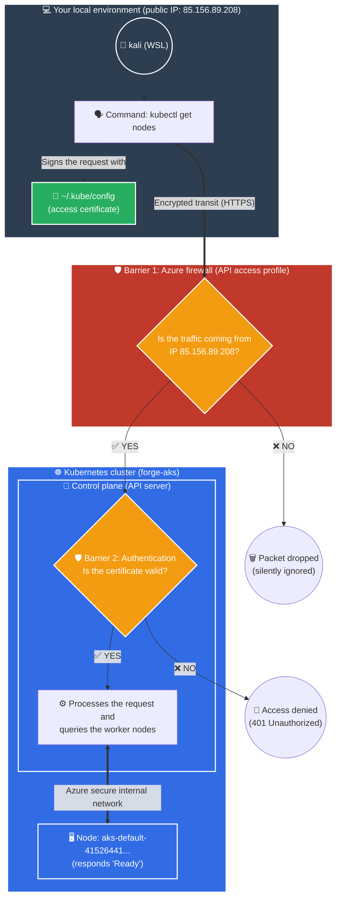
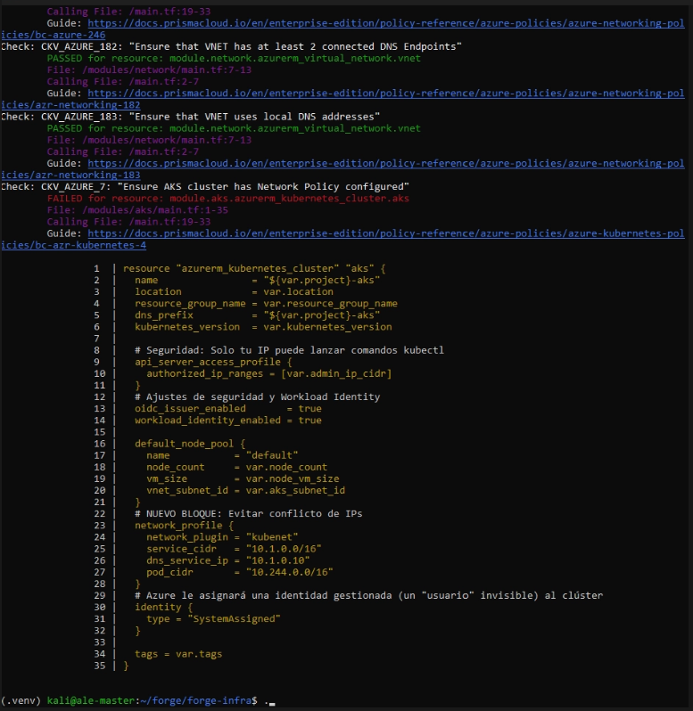
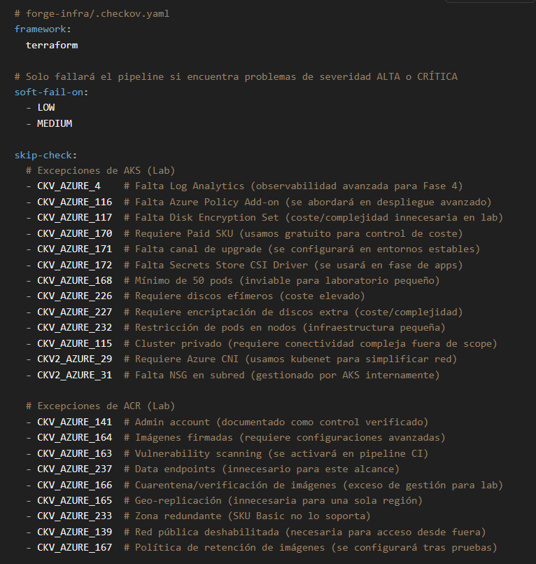
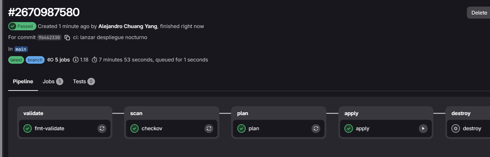

# Forge Infrastructure: Foundations & SecOps 🛡️☁️

This repository holds the Infrastructure-as-Code (IaC) for **Phase 0** of the **Forge** project. The goal is to establish a solid, secure and automated foundation on Azure using Terraform, applying DevSecOps principles from the very start of the development lifecycle.


---

## 🏗️ Architecture & components

The deployment provisions the foundational resources on Microsoft Azure using a modularized design:
*   **Azure Kubernetes Service (AKS):** base cluster with the free control plane for workload orchestration.
*   **Azure Container Registry (ACR):** private container registry on the *Basic* tier.
*   **Azure Virtual Network (VNet):** virtual network and dedicated subnets to isolate the cluster.
*   **Azure Storage Account:** secure storage for the Terraform backend and *state* locking.
> 💡 **Architecture note on remote state:** as shown in the diagram below, the **Azure Storage Account** that manages Terraform state (`.tfstate`) is deliberately kept *outside* the perimeter of the main resource group (`forge-rg`). For reasons of security, persistence and decoupling, it lives isolated in its own independent group (`forge-tfstate-rg`). This strategic separation guarantees that when tearing down ephemeral infrastructure (`make destroy`), the cluster's "memory" stays intact and shielded from accidental deletion.


### Verification in the Azure portal
The correct creation of the resource groups and the network/compute components was validated directly from the Azure Manager console:





---

## 🔒 Design & security decisions (SecOps)

This project follows professional security guidelines and cloud engineering best practices:

*   **Remote state with locking:** the Terraform state file (`.tfstate`) is stored remotely in an Azure Storage Account, preventing accidental exposure of secrets and enabling safe collaboration through *state locking*.
*   **Network security & restricted API:** the AKS cluster's control plane (API server) is protected via `authorized_ip_ranges`, allowing administration exclusively from trusted IPs. Any external request outside that range is silently dropped by the firewall.



*   **Secretless authentication (managed identities):** the AKS cluster is authorized to pull images from ACR through a managed identity with the `AcrPull` role, without static credentials. OIDC and *Workload Identity* were also enabled to support native, secretless pod authentication in later phases.

---

## ⚠️ Security & compliance (IaC analysis)

The infrastructure scan run with **Checkov** reports 21 findings. Most of these exceptions are technically justified because this environment is a **budget-constrained lab** (use of *Basic* SKUs, no regional high availability, and simplified network configurations).



Every exception is documented in detail, with its engineering rationale, inside the `.checkov.yaml` file. These security configurations are planned to be enabled incrementally as the project moves toward production phases.



---

## 🤖 Continuous Integration (CI/CD)

The infrastructure lifecycle is 100% automated with GitLab CI, embedding static analysis (SAST) directly in the pipeline before any change to real state is allowed.



*   **validate:** syntactic (`terraform fmt`) and structural validation.
*   **scan:** security policy compliance analysis with Checkov.
*   **plan:** detailed preview of the resource changes.
*   **apply / destroy:** gated behind manual execution, for security and budget-control reasons.

---

## 💰 Cost control & ephemeral infrastructure

To keep the lab viable and maintain financial hygiene, the project assumes an **ephemeral infrastructure** approach. No orphaned resources are left running.

A convenience `Makefile` unifies the complex Terraform and Azure CLI commands. It makes it easy to stand the architecture up quickly at the start of the day and tear it down cleanly at the end of the working session.

**Daily developer workflow:**
```bash
# 1. Stand up the full environment
make apply

# 2. Configure local credentials to interact with kubectl
make creds

# 3. Destroy all infrastructure to avoid residual costs
make destroy
```

### 📝 Validation checklist (Phase 0 complete)

The integrity and correct operation of the environment were validated through the following technical checks, run locally:

- [x] Remote state on Azure Storage working with no syntax or connection errors.
- [x] `terraform apply` stands up the RG, VNet, ACR and AKS successfully.
- [x] `kubectl get nodes` returns 1 node in `Ready` state.
- [x] `az acr login` authenticates correctly against the private registry.
- [x] Azure RBAC integration (`AcrPull`) confirmed between services.
- [x] Workload Identity and OIDC issuer enabled on the cluster.
- [x] GitLab pipeline green, and infrastructure cleaned up successfully with `make destroy`.
