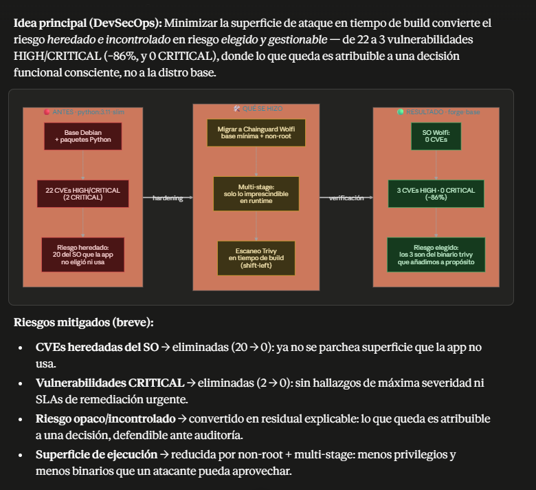
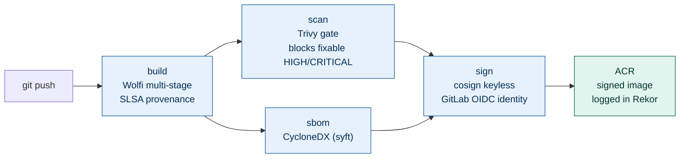
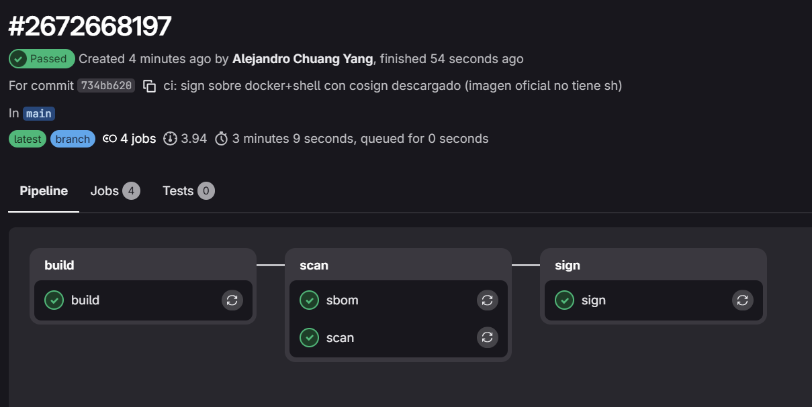
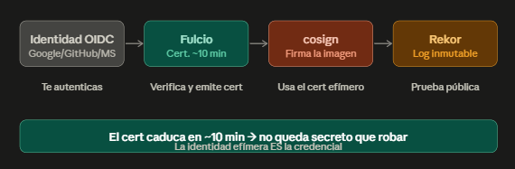
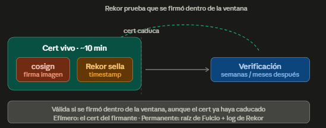
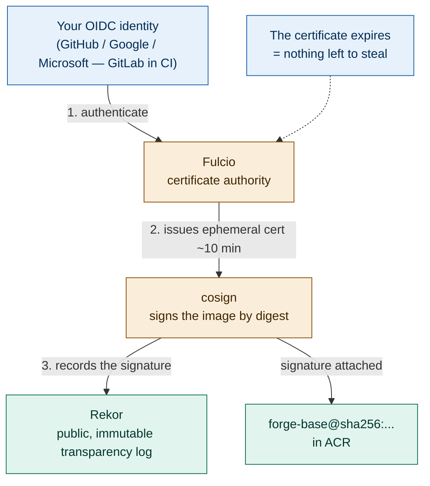
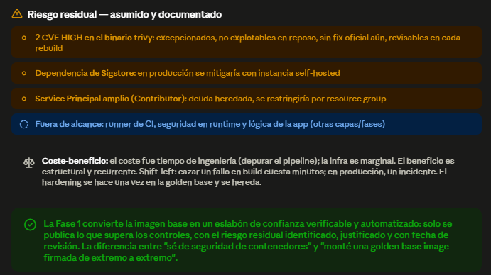
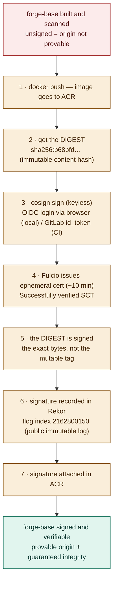

# forge-images · Phase 1 — Hardened, signed golden base image

**Supply-chain security for containers, end to end:** a hardened base image built on Chainguard Wolfi, gated by Trivy, inventoried with an SBOM, and **signed without keys** (Sigstore keyless: OIDC → Fulcio → Rekor) — all automated in a GitLab CI pipeline where **the pipeline's own identity is the signer**.

> **The 10-second version:** attack surface cut **from 22 HIGH/CRITICAL CVEs to 3 (−86%), with 0 CRITICAL and 0 CVEs in the base OS**. Every push produces an image that is hardened, scanned, inventoried and cryptographically signed — with **zero signing secrets to manage**.

<!-- 📷 HERO — usa tu diagrama de 3 paneles "ANTES / QUÉ SE HIZO / RESULTADO" (image_14.png) -->


---

## Key results

| Metric | `python:3.11-slim` (industry default) | `forge-base` (this project) |
|---|---|---|
| HIGH/CRITICAL CVEs (total) | **22** (incl. 2 CRITICAL) | **3 HIGH · 0 CRITICAL (−86%)** |
| CVEs in the base OS | 20 (Debian, inherited) | **0** (Wolfi, 35 packages) |
| Runs as | root | **non-root (uid 65532)** |
| Provenance | none | **SLSA attestation** |
| Inventory | none | **SBOM CycloneDX — 448 packages, 5,117 refs** |
| Signature | none | **keyless, by digest, logged in Rekor** (tlog `2162800150`) |

The 3 remaining HIGH findings live in the **bundled `trivy` binary** (a third-party tool packaged for Phase 2) — not in the OS, not in the app. Two of them are formally excepted with written justification (see [Risk management](#risk-management-what-was-not-fixed)). The point: risk went from *inherited and uncontrolled* to **chosen, attributable and auditable**.

---

## Why this matters

Every serious platform team asks: *"is the image my cluster runs **exactly** the one I built — hardened, untampered?"* The industry default answer is *"we trust so."* After this phase, the answer is **"we can prove it"** — cryptographically, for every build, with no human in the loop.

This is the **golden base image** pattern used by mature platform organizations: hardening is done **once**, centrally, and every product team inherits it via `FROM forge-base` — instead of each team reinventing it (worse) per app.

---

## Pipeline architecture

Four chained controls acting as gates — if one fails, nothing downstream runs. The image **digest** (`sha256:…`) is computed once at build and propagated to every later stage, so **the exact same bytes are scanned, inventoried and signed**.



| Stage | Control | Guarantee |
|---|---|---|
| `build` | SLSA provenance + push by digest | Traceability: how and where it was built |
| `scan` | Trivy as a blocking gate (`--exit-code 1`, fixable-only) | No image with a remediable HIGH/CRITICAL CVE reaches the registry |
| `sbom` | CycloneDX inventory (syft) | Instant answer to "does this new CVE affect us?" |
| `sign` | Keyless signing with the pipeline's OIDC identity | Authenticity + integrity, with **no stored key** |

<!-- 📷 Pipeline en verde — tu captura real de GitLab #2672668197, 4 jobs, 3m09s (image_32.png) -->


---

## The differentiator: keyless signing

Traditional signing depends on a **long-lived private key** — a secret to store, rotate, and leak. Keyless removes the secret entirely:

<!-- 📷 Flujo keyless — tu diagrama OIDC → Fulcio → cosign → Rekor (image_22.png) -->


1. The GitLab job presents its **OIDC identity** (an `id_token` minted per job — no credential stored anywhere).
2. **Fulcio** verifies it and issues an **ephemeral certificate (~10 min)**.
3. **cosign** signs the image **by digest** — a tag (`0.1.0`, `latest`) is mutable and can be re-pointed; the digest is the immutable hash of the exact bytes.
4. The signature is recorded in **Rekor**, a public, immutable transparency log.

The certificate expires in minutes, so **there is nothing left to steal** — the ephemeral identity *is* the credential. Verification doesn't need the cert to still be alive: Rekor's timestamp proves the signature was created **while it was** — that's what makes a "10-minute signature" valid forever.

<!-- 📷 Timeline de validez — tu diagrama "por qué una firma de 10 min vale para siempre" (image_25.png) -->


The whole signing flow, from identity to public log:



### Verify it yourself

The signature is public — no need to take my word for it. Anyone can confirm the image was signed **by this exact pipeline** (trust in *who* signs, not just *that* there is a signature), or inspect the Rekor entry directly at **tlog index `2162800150`**:

```bash
cosign verify \
  --certificate-identity-regexp "https://gitlab.com/alejandrochuang/forge-images//.gitlab-ci.yml.*" \
  --certificate-oidc-issuer "https://gitlab.com" \
  "$ACR_LOGIN_SERVER/forge-base@sha256:b68bfd1838d1a0673bafd556ea0e844896fd3de111ff6f2f69349d274d864734" \
  | jq '.[0].optional.Subject, .[0].optional.Issuer'
```

---

## Engineering decisions (the *why*, not just the *what*)

**Wolfi — not pure distroless, not Debian slim.** The app (Phase 2) shells out to `nmap` and `trivy`, so the base must be able to install binaries — ruling out distroless. Debian slim drags 20 OS CVEs. Chainguard Wolfi is the correct fit: minimal, glibc-compatible, ships `apk`, non-root by default. Picking the tool that matches the *actual constraint* is the core decision of this phase.

**Multi-stage, base/app split.** A throwaway `builder` stage installs tooling; the final runtime keeps only what's needed. The base changes rarely and is reused; the app changes often — separate lifecycles, separate repos, supply-chain hygiene.

**Gate policy: block only what's actionable.** `--ignore-unfixed` — a HIGH with no upstream patch isn't actionable today, so it doesn't break the build; anything fixable does (`--exit-code 1`). Shift-left economics: a flaw caught at build costs minutes; in production, an incident.

**Fix > except, in that order.** When the gate blocked on 2 HIGH in the bundled trivy binary, the first move was a rebuild against the latest upstream (failed — no patched binary published yet), and **only then** a documented exception. Jumping straight to the exception is assuming risk out of laziness.

---

## Production debugging: making the pipeline converge

A first CI pipeline against real cloud almost never passes on the first run. This one converged after diagnosing and fixing, in sequence:

| Failure | Diagnosis → fix |
|---|---|
| `azure-cli: no such package` | Package doesn't exist on Alpine → dropped Azure CLI, authenticate ACR with `docker login` + Service Principal |
| `pyexpat symbol not found` | Broken Python lib inside `docker:27` → removed the Azure CLI install entirely |
| `Invalid client secret` | `ARM_CLIENT_SECRET` pasted with JSON quotes/whitespace → re-pasted clean |
| `Attestation is not supported for the docker driver` | `--provenance` requires the `docker-container` driver → `buildx create --driver docker-container` |
| `build.env: Invalid Format` (×2) | Digest captured with trailing noise → extracted clean from `metadata.json` with a strict regex |
| `exec: "sh" not found` in scan/sbom/sign | Official trivy/syft/cosign images ship no shell → run on `docker:27`, fetch the binary at job start |
| `TLS handshake timeout` vs ACR | Intermittent runner(US) ↔ ACR(EU) latency → tolerated by buildx native retries |

> The real learning wasn't the YAML — it was **iterative debugging against live cloud**: credentials, build drivers, shell-less images, network latency. A pipeline isn't written; it's *made to converge* — run, read the failure, adjust, repeat.

---

## Risk management (what was *not* fixed)

An honest model beats an all-green one. Residual risk, identified and documented:

- 🟡 **2 HIGH CVEs in the bundled trivy binary** (`CVE-2026-50151` oras-go, `CVE-2026-39822` stdlib) — excepted in `.trivyignore` with written justification: not exploitable at rest (tool sits inert in the base image), no fixed upstream binary yet, re-reviewed on every rebuild.
- 🟡 **Sigstore availability dependency** — keyless sign/verify relies on Sigstore's public infrastructure; production mitigation: self-hosted instance.
- 🟡 **Broad Service Principal** (Contributor, inherited from Phase 0) — known debt; production would scope it to the resource group.
- 🔵 **Out of scope for this phase:** CI runner compromise, runtime security, app logic — addressed in later phases/layers.

<!-- 📷 Riesgo residual — tu infografía ámbar/azul (image_37.png) -->


---

## Cost engineering

Ephemeral-infra discipline, applied selectively: at the end of each session the AKS node is **stopped, not destroyed** (`az aks stop`) — compute was the real cost (~$1–1.50/day), while ACR Basic is marginal (~$0.17/day). Keeping the registry alive preserves the signed image, its SBOM, the signature's validity and the GitLab CI variables (the ACR name carries a random suffix that changes on every recreate). Resume in ~2–3 min with `az aks start`, zero reconfiguration. Cost awareness as part of the design — stop what's expensive, keep what's valuable, document the trade-off.

---

## Appendix — the signing sequence, step by step

The manual proof-of-concept run (before the pipeline automated it), for reference:



---

## Stack

`Chainguard Wolfi` · `Docker Buildx` (multi-stage, docker-container driver, SLSA provenance) · `Trivy` · `Syft` (SBOM CycloneDX) · `cosign` / `Sigstore` (Fulcio + Rekor) · `GitLab CI` (OIDC `id_tokens`) · `Azure Container Registry` · `AKS` + `Terraform` (Phase 0)

## Repository layout

```
forge-images/
├── Dockerfile.base     # hardened multi-stage base (Wolfi, non-root 65532, OCI labels)
├── .trivyignore        # CVE exceptions — each one justified in writing
├── .dockerignore
├── .gitlab-ci.yml      # build → scan → sbom → sign (keyless)
├── Makefile            # local convenience: scan / compare (pipeline is the source of truth)
├── scripts/scan.sh     # blocking gate + SBOM generation
└── docs/img/           # evidence for this README
```

## Project context

**Phase 0** (repo `forge-infra`): Azure foundations with Terraform — AKS, ACR, Workload Identity, remote state, IaC scanning with Checkov. ✅
**Phase 1** (this repo): hardened, signed golden base image. ✅
**Phase 2** (next): the application (`SecurityScanService`, FastAPI) inherits `FROM forge-base` — pinned dependencies, app SBOM, keyless signing of the app image.
**Phase 3:** admission policy (Kyverno) on AKS — unsigned images don't deploy.
