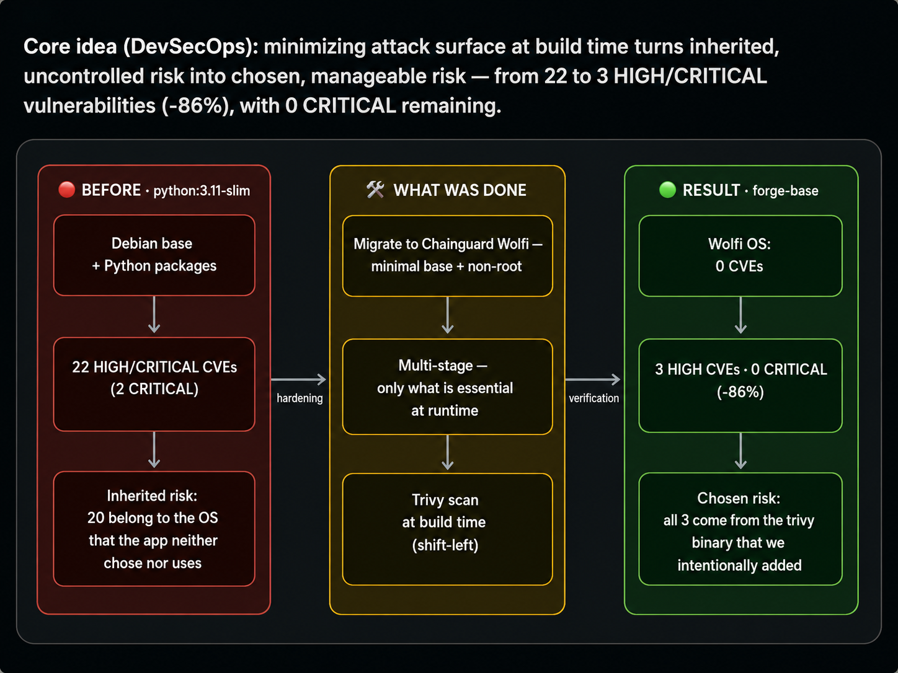
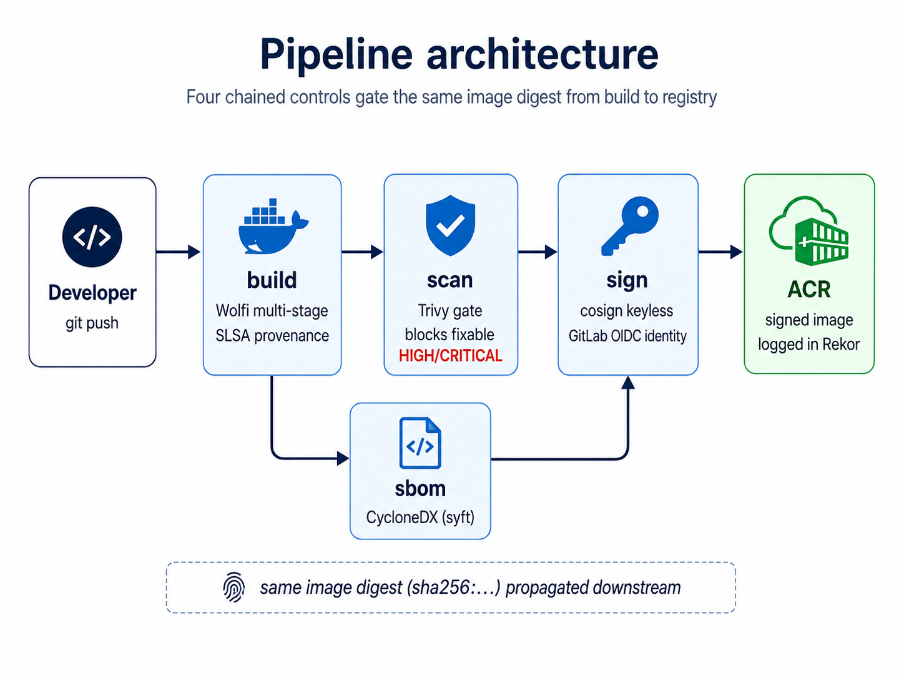
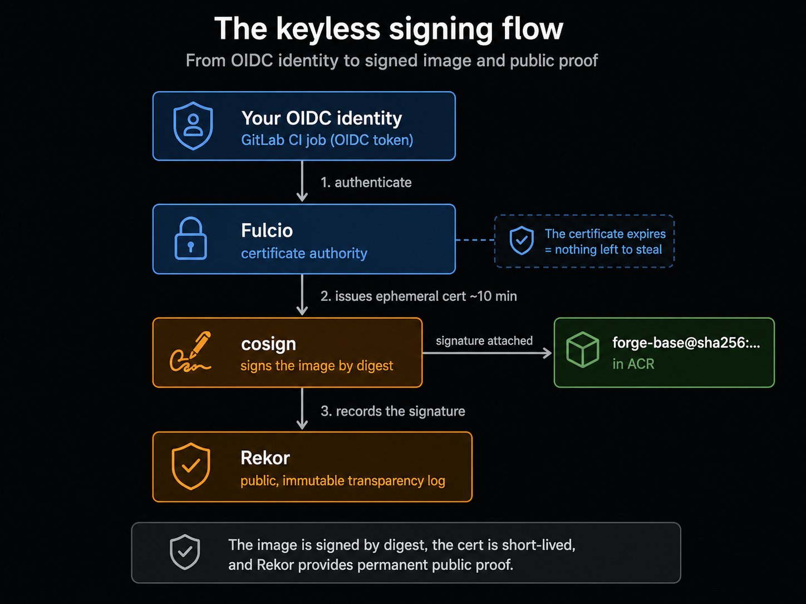
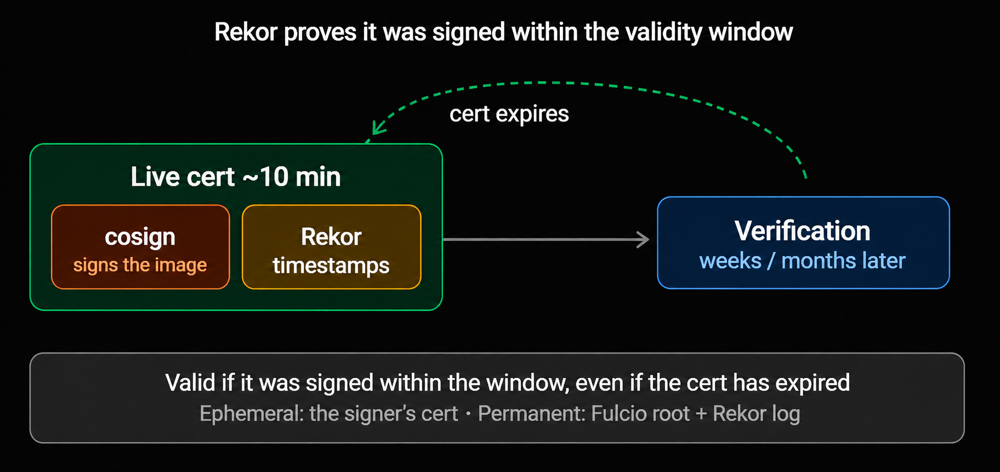
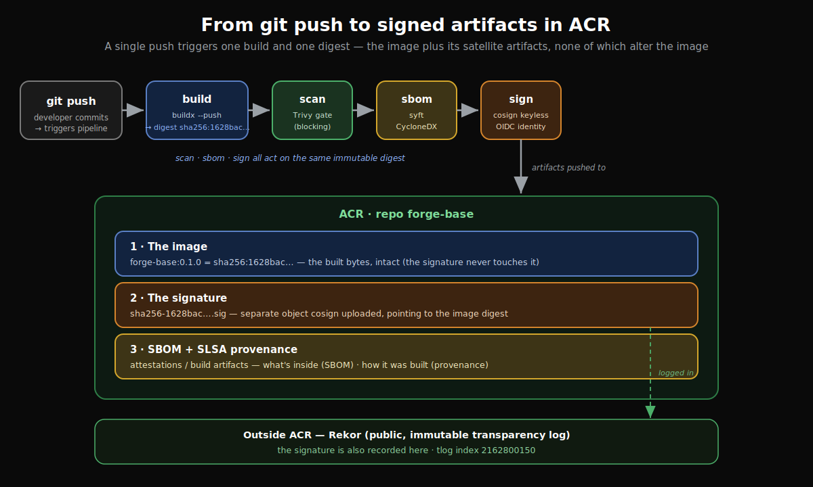
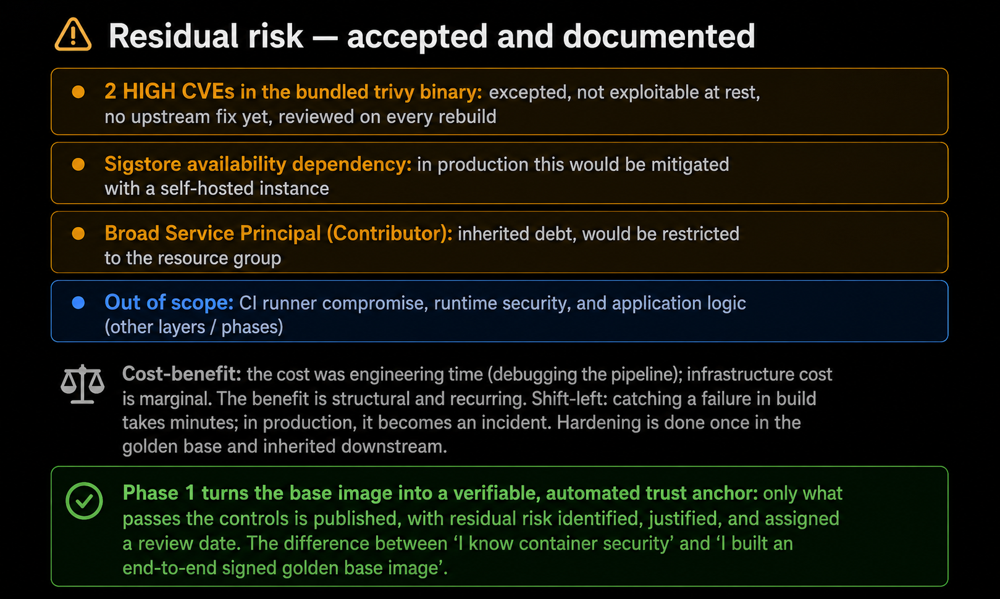
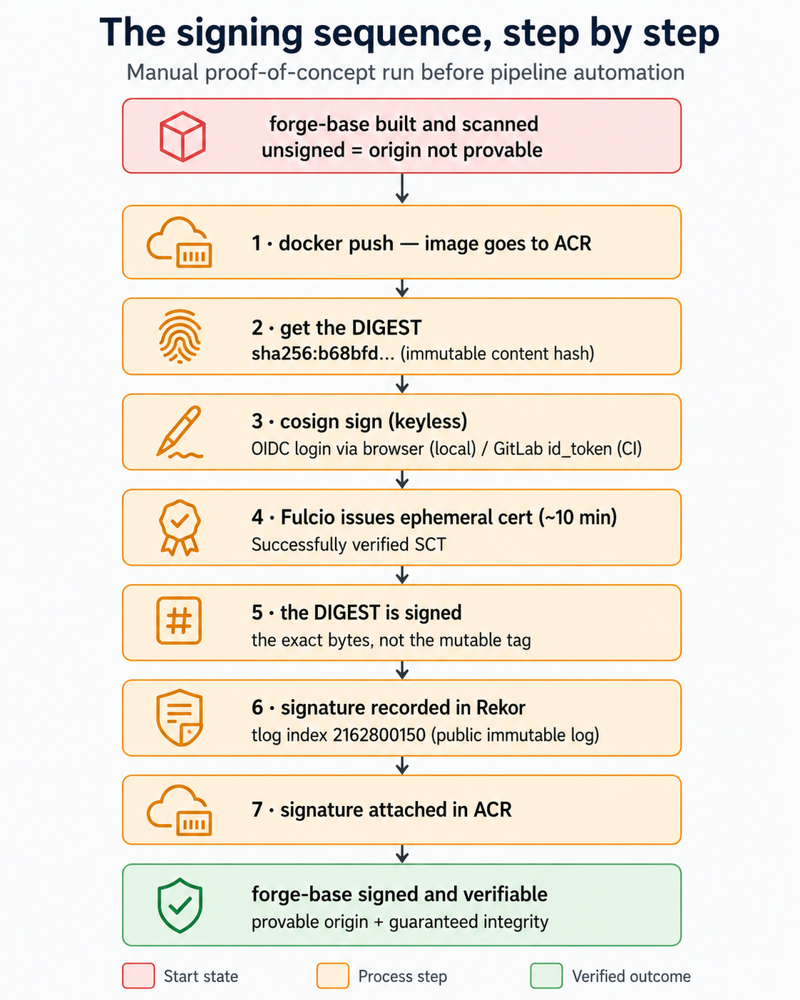

# forge-images · Phase 1 — Hardened, signed golden base image

**Supply-chain security for containers, end to end:** a hardened base image built on Chainguard Wolfi, gated by Trivy, inventoried with an SBOM, and **signed without keys** (Sigstore keyless: OIDC → Fulcio → Rekor) — all automated in a GitLab CI pipeline where **the pipeline's own identity is the signer**.


*Attack surface before and after hardening.*

> **What are Chainguard and Wolfi?** **Chainguard** builds minimal, security-focused
> container images. **Wolfi** is their container-native Linux *undistro* — not a
> general-purpose OS like Debian, but a stripped-down base with only the essentials:
> `apk` package manager, glibc compatibility, non-root by default. That minimalism is
> why the base OS here scans at **0 CVEs** versus 20 on Debian slim.

**Mitigated risks:**

- **OS-inherited CVEs → eliminated (20 → 0):** no longer patching attack surface the application does not use.
- **CRITICAL vulnerabilities → eliminated (2 → 0):** no highest-severity findings, no urgent remediation SLAs.
- **Opaque / uncontrolled risk → turned into explainable residual risk:** what remains is attributable to a deliberate decision, defensible under audit.
- **Execution surface → reduced via non-root + multi-stage:** fewer privileges and fewer binaries for an attacker to exploit.

---

## Key results

| Metric | `python:3.11-slim` (industry default) | `forge-base` (this project) |
|---|---|---|
| HIGH/CRITICAL CVEs (total) | **22** (incl. 2 CRITICAL) | **3 HIGH · 0 CRITICAL (−86%)** |
| CVEs in the base OS | 20 (Debian, inherited) | **0** (Wolfi, 35 packages) |
| Runs as | root | **non-root (uid 65532)** |
| Provenance | none | **SLSA attestation** |
| Inventory | none | **SBOM CycloneDX — 448 packages, 5,117 refs** |
| Signature | none | **keyless, by digest, logged in Rekor** (tlog `2162800150`) |

The 3 remaining HIGH findings live in the **bundled `trivy` binary** (a third-party tool packaged for Phase 2) — not in the OS, not in the app. Both are formally excepted with written justification (see [Residual management](#residual-risk-what-was-not-fixed)). The point: risk went from *inherited and uncontrolled* to **chosen, attributable and auditable**.

---

## Why this matters

Every serious platform team asks: *"is the image my cluster runs **exactly** the one I built — hardened, untampered?"* The industry default answer is *"we trust so."* After this phase, the answer is **"we can prove it"** — cryptographically, for every build, with no human in the loop.

This is the **golden base image** pattern used by mature platform organizations: hardening is done **once**, centrally, and every product team inherits it via `FROM forge-base` — instead of each team reinventing it (worse) per app.

---

## What gets built

A multi-stage Dockerfile on `cgr.dev/chainguard/wolfi-base`. A throwaway `builder` stage installs the system tooling; the final runtime stage keeps only what is strictly needed and runs unprivileged. The two mechanisms below are what make the final image small and hard to abuse.

**Key Code — `Dockerfile.base`**

```dockerfile
# ---- Stage 1: builder — installs the system tooling on Wolfi ----
FROM cgr.dev/chainguard/wolfi-base:latest AS builder

# apk is Wolfi's package manager. Install the Python runtime, nmap and the
# utilities the app needs to operate.
RUN apk add --no-cache \
    python-3.11 \
    py3.11-pip \
    nmap \
    curl \
    ca-certificates

# Install the official trivy binary into a stable path.
RUN curl -sfL https://raw.githubusercontent.com/aquasecurity/trivy/main/contrib/install.sh \
    | sh -s -- -b /usr/local/bin

# ---- Stage 2: final runtime ----
FROM cgr.dev/chainguard/wolfi-base:latest

# Reinstall only the runtime packages (no build utilities in the final image).
RUN apk add --no-cache \
    python-3.11 \
    py3.11-pip \
    nmap \
    ca-certificates

# 🛡️ DEFENSE: copy only the trivy binary from the builder — the installer,
# curl and build caches never reach the final image.
COPY --from=builder /usr/local/bin/trivy /usr/local/bin/trivy

# 🛡️ DEFENSE: non-root by default. Wolfi already ships the 'nonroot' user
# (uid 65532); we reuse it instead of creating one.
USER 65532

ENTRYPOINT ["python3.11"]
```

**What it does and why it matters.** The **two `FROM` statements are deliberate** — this is a multi-stage build. Stage 1 (`builder`) is a throwaway environment where tooling like `curl` and the trivy installer run freely. Stage 2 starts *fresh* from the same clean Wolfi base and pulls in only what's needed at runtime: the `COPY --from=builder` brings across just the compiled `trivy` binary, leaving every build-time tool behind. The result is a smaller, harder-to-abuse final image — every tool that isn't there is one an attacker can't use and one you never have to patch. `USER 65532` then drops root permanently, so a compromised container is limited to an unprivileged user (this is why `docker run ... -c "import os; print(os.getuid())"` returns `65532`, not `0`).

---

## Pipeline architecture

Every push triggers a GitLab CI pipeline of four chained controls acting as gates: if one fails, nothing downstream runs. The image **digest** (`sha256:…`) is computed once at build and propagated to every later stage, so **the exact same bytes are scanned, inventoried and signed**.


*The four-stage pipeline: build → scan → sbom → sign.*

| Stage | Control | Guarantee |
|---|---|---|
| `build` | SLSA provenance + push by digest | Traceability: how and where it was built |
| `scan` | Trivy as a blocking gate (`--exit-code 1`, fixable-only) | No image with a remediable HIGH/CRITICAL CVE reaches the registry |
| `sbom` | CycloneDX inventory (syft) | Instant answer to "does this new CVE affect us?" |
| `sign` | Keyless signing with the pipeline's OIDC identity | Authenticity + integrity, with **no stored key** |

> **What is "keyless" signing?** Instead of a long-lived private key that must be stored,
> rotated and protected — and that lets an attacker sign malware as you if it leaks.
> *Keyless* (Sigstore) signs with the pipeline's own short-lived identity. There is no
> signing secret to store or steal. See [The differentiator: keyless signing](#the-differentiator-keyless-signing) below for the full flow.

### Authenticating to the registry without Azure CLI

The pipeline needs to push to a private Azure Container Registry. Instead of installing the (heavy, and on Alpine, frequently broken) Azure CLI just to run `az acr login`, we authenticate Docker directly with the Service Principal credentials.

**Key Code — `.gitlab-ci.yml` (`build.before_script`)**

```yaml
before_script:
  # 🛡️ DEFENSE: authenticate to ACR with the Service Principal, no Azure CLI.
  # Docker accepts the SP's client ID/secret as username/password.
  - echo "$ARM_CLIENT_SECRET" | docker login "$ACR_LOGIN_SERVER" -u "$ARM_CLIENT_ID" --password-stdin
  - docker buildx create --name forgebuilder --driver docker-container --use
  - docker buildx inspect --bootstrap
```

**What it does and why it matters.** `docker login --password-stdin` reads the secret from a pipe rather than an argument, so it never lands in the process list or shell history. An ACR is a standard OCI registry, so Docker can authenticate to it natively — no reason to pull in a whole CLI for a login. Fewer dependencies means a faster job and less that can break (this decision came *after* two failed attempts to install Azure CLI on the Alpine-based `docker:27` image). The `buildx create --driver docker-container` line is required for the `--provenance` attestation later — the default `docker` driver doesn't support it.

### The Trivy gate

This is the control that turns "we scanned the image" into "an unsafe image cannot be published".

**Key Code — `.gitlab-ci.yml` (`scan.script`)**

```yaml
script:
  - trivy image --severity HIGH,CRITICAL --ignore-unfixed --exit-code 1 --ignorefile .trivyignore "${IMAGE_NAME}@${DIGEST}"
```

**What it does and why it matters.** Four flags turn a report into a gate: `--exit-code 1` makes Trivy *fail the pipeline* on a finding (a report just prints; a gate stops the line); `--severity HIGH,CRITICAL` scopes it to what's actionable; `--ignore-unfixed` blocks only CVEs that have a patch available (an unfixable CVE isn't something you can act on today, so it shouldn't break builds); `--ignorefile .trivyignore` applies the documented exceptions. Note it scans `@${DIGEST}`, not the tag — the same immutable bytes that were built.

---

## The differentiator: keyless signing

Traditional signing depends on a **long-lived private key** — a secret to store, rotate, and eventually leak. If it leaks, an attacker signs malware as you. Keyless removes the secret entirely: instead of a key, the signer proves *who it is* with a short-lived identity, and that identity is what the signature is bound to.


*From OIDC identity to signed image and public proof — the signer authenticates, Fulcio issues an ephemeral certificate (~10 min), cosign signs by digest, and Rekor keeps the public record. The signature is attached to `forge-base@sha256:…` in ACR.*

1. The GitLab job presents its **OIDC identity** (an `id_token` minted per job — no credential stored anywhere).
2. **Fulcio** verifies it and issues an **ephemeral certificate (~10 min)**.
3. **cosign** signs the image **by digest** — a tag (`0.1.0`, `latest`) is mutable and can be re-pointed; the digest is the immutable hash of the exact bytes.
4. The signature is recorded in **Rekor**, a public, immutable transparency log.

>Why signed "by digest" and not by tag? An image can be referenced two ways: by a tag (`forge-base:0.1.0`, a human-friendly label) or by its digest (`forge-base@sha256:1628bac…`, the SHA-256 hash of its exact contents). A tag is mutable — anyone can later re-point `0.1.0` to a different image. A digest is immutable — change one byte and the hash changes completely. That is why the signing command targets the digest, not the tag:
>
>```bash
># bash
>cosign sign --yes "${IMAGE_NAME}@${DIGEST}"   # @${DIGEST} = >@sha256:1628bac…
>```
>
>Signing by digest binds the signature to the exact bytes that were audited, so nobody can slip a different image under the same name. You sign the content, not the label.

### How the pipeline signs with no key

The magic is one small block: it tells GitLab to mint an OIDC token that Fulcio will accept as the pipeline's identity.

**Key Code — `.gitlab-ci.yml` (`.sigstore_id_token` + `sign` job)**

```yaml
.sigstore_id_token:
  id_tokens:
    SIGSTORE_ID_TOKEN:
      aud: sigstore

sign:
  stage: sign
  extends: .sigstore_id_token
  image: docker:27
  services:
    - docker:27-dind
  before_script:
    - apk add --no-cache curl
    - curl -sfL "https://github.com/sigstore/cosign/releases/download/v2.4.1/cosign-linux-amd64" -o /usr/local/bin/cosign
    - chmod +x /usr/local/bin/cosign
    - echo "$ARM_CLIENT_SECRET" | docker login "$ACR_LOGIN_SERVER" -u "$ARM_CLIENT_ID" --password-stdin
  script:
    # 🛡️ DEFENSE: keyless signing — cosign uses the GitLab id_token as its
    # identity before Fulcio. There is no stored key anywhere.
    - cosign sign --yes "${IMAGE_NAME}@${DIGEST}"
```

**What it does and why it matters.** The `id_tokens` block makes GitLab issue a signed OIDC token (audience `sigstore`) for this job. `cosign sign` picks it up automatically, presents it to Fulcio, and gets a short-lived certificate to sign with — no `cosign.key` file, no secret in the CI variables, nothing to rotate. The signer's identity is the CI job itself, which is why the signature can later be verified against that exact identity (below). Note the job downloads the cosign binary onto `docker:27` rather than using the official cosign image — that image ships without a shell, which GitLab needs to run the job's script.

### Why a ~10-minute certificate produces a permanently verifiable signature

A natural worry: if the certificate lives ~10 minutes, how can the signature be verified weeks later?


*Rekor proves the signature was created while the certificate was valid: cosign signs and Rekor timestamps inside the ~10-min window, so verification months later still succeeds. Ephemeral: the signer's cert. Permanent: the Fulcio root + the Rekor log.*

Verification doesn't need the certificate to still be alive: Rekor's timestamp proves the signature was created *while it was*. That is what makes a "10-minute signature" valid forever.

### Verify it yourself

The signature is public — no need to take my word for it. Anyone can confirm the image was signed **by this exact pipeline** (trust in *who* signs, not just *that* there is a signature).

**Key Code — end-to-end verification**

```bash
cosign verify \
  --certificate-identity "https://gitlab.com/alejandrochuang/forge-images//.gitlab-ci.yml@refs/heads/main" \
  --certificate-oidc-issuer "https://gitlab.com" \
  "${ACR_LOGIN_SERVER}/forge-base@${DIGEST}" \
  | jq '.[0].optional.Subject, .[0].optional.Issuer'
```

**What it does and why it matters.** The key flag is `--certificate-identity` with the *exact* pipeline path — not a `.*` wildcard. A wildcard only proves "there is some valid signature"; the exact identity proves "it was signed by *this* pipeline, on `main`, and nobody else". That distinction is what turns a signature from informational into an enforceable control. This is the very same check the Kyverno admission gate will run in-cluster in **Phase 3** to accept or reject images at deploy time.

---

## SBOM and SLSA provenance: what's inside and how it was built

A signature proves the image is *authentic and untampered*, but a consumer of the image asks two more questions: **what does it contain?** and **how was it built?** The pipeline answers both, as machine-readable artifacts generated on every push.

**SBOM (Software Bill of Materials) — *what's inside.*** A complete inventory of every OS package and library in the image (448 components here), generated with syft in CycloneDX format. When the next CVE drops, you don't re-scan blindly — you query the SBOM and know in seconds whether you're affected.

**SLSA provenance — *how and where it was built.*** A signed attestation, produced by buildx, recording the build's origin: which commit, which pipeline, which parameters. It's the difference between "trust me, I built this cleanly" and a verifiable record of the build itself.

**Key Code — `.gitlab-ci.yml` (`build` and `sbom`)**

```yaml
# in the build job — provenance is generated and attached at build time
docker buildx build \
  --provenance=true \
  --metadata-file metadata.json \
  --push \
  .

# the sbom job — full component inventory, kept as an artifact
syft "${IMAGE_NAME}@${DIGEST}" -o cyclonedx-json=sbom.cdx.json
```


**What it does and why it matters.** `--provenance=true` tells buildx to emit a SLSA provenance attestation and push it alongside the image (this is why the `docker-container` driver was required earlier). The `syft` command inventories the *exact same digest* that was built and scanned, so the SBOM describes precisely what ships — not a rebuild that might differ. Both are produced automatically on every push; neither depends on anyone remembering to run them.

**Risk mitigated.** Together with the signature, these close the supply-chain visibility gap: **origin is verifiable** (provenance — you can prove the build wasn't tampered with or produced elsewhere) and **contents are auditable** (SBOM — no hidden or unknown components). An image without them is a black box you trust on faith; with them, every claim about the artifact is checkable.

### From push to registry: what ends up stored

The controls in this phase don't rewrite the image — they surround it. A single `git push` triggers one build that produces one image (identified by its digest); scan, SBOM and sign then all act on **that same digest**. The result in ACR is the image plus two **satellite artifacts** that sit beside it without modifying it: the signature is a separate object, and the SBOM and provenance are attestations attached to the build. That's precisely why the image's digest stays identical before and after signing. The signature is *also* recorded outside ACR, in Sigstore's public Rekor log.


*A single git push drives the whole chain: build → scan → sbom → sign, ending in ACR with the image and its satellite artifacts (signature, SBOM, provenance) — plus the signature logged in Rekor.*

**How the digest travels the chain.** The `build` stage captures the digest once — the moment buildx pushes the image — and hands it to the three downstream stages (`scan`, `sbom`, `sign`) through a GitLab `dotenv` artifact. That single value is what keeps all four stages pinned to the exact same bytes.

**Key Code — `.gitlab-ci.yml` (`build.script`)**

```yaml
# buildx computes the image digest at --push time and writes it to metadata.json
- DIGEST=$(grep -o '"containerimage.digest": *"[^"]*"' metadata.json | grep -o 'sha256:[a-f0-9]*')
- if [ -z "$DIGEST" ]; then echo "ERROR: digest vacio"; exit 1; fi
- echo "DIGEST=${DIGEST}" > build.env   # exported to scan/sbom/sign via artifacts.reports.dotenv
```

**What it does and why it matters.** buildx writes the built image's digest to `metadata.json`; the chained `grep`s extract a clean `sha256:…` string, saved to `build.env` and exported as a `dotenv` report artifact — making `$DIGEST` available in every later stage. This is what guarantees `scan`, `sbom` and `sign` all act on **the exact image that was built**, closing the window where a mutable tag could point somewhere else in between. (The `if [ -z ... ]` guard fails loudly if the digest ever comes back empty, rather than silently producing a broken artifact.)

---

## Engineering decisions (the *why*, not just the *what*)

**Wolfi — not pure distroless, not Debian slim.** The app (Phase 2) shells out to `nmap` and `trivy`, so the base must be able to install binaries — ruling out distroless (no package manager). Debian slim drags 20 OS CVEs. Chainguard Wolfi is the correct fit: minimal, glibc-compatible, ships `apk`, non-root by default. Picking the tool that matches the *actual constraint* is the core decision of this phase.

**Multi-stage, base/app split.** A throwaway `builder` stage installs tooling; the final runtime keeps only what's needed. The base changes rarely and is reused; the app changes often — separate lifecycles, separate repos, supply-chain hygiene.

**Fix > except, in that order.** When the gate blocked on 2 HIGH in the bundled trivy binary, the first move was a rebuild against the latest upstream (failed — no patched binary published yet), and **only then** a documented exception. Jumping straight to the exception is assuming risk out of laziness.

---

## Vulnerability policy: fix > exception > never silence

The gate blocks only *fixable* findings; anything excepted must carry a written, contextual justification. This is the difference between *managing* residual risk and *silencing* it.

**Key Code — `.trivyignore`**

```gitignore
# =============================================================================
# .trivyignore — JUSTIFIED vulnerability exceptions
# Rule: every CVE is read, its exploitability reasoned IN THIS context,
# and documented. Never silenced blindly. Reviewed on every rebuild.
# =============================================================================

# CVE-2026-50151 — oras.land/oras-go/v2 (HIGH, fixed in 2.6.1)
# Vulnerability: credential forwarding via unvalidated Location header
# when PUSHING blobs to an OCI registry.
# Justification: lives in the trivy binary (a packaged tool), NOT in the
# base OS nor in the app. The base image does not run trivy — it transports
# it for the app to use in Phase 2. The vector (push to registry) is not
# reachable at rest. The fix exists in the library, but the official trivy
# binary does not yet ship it (not actionable on our side).
# Review: remove as soon as Aqua publishes a recompiled binary.
CVE-2026-50151

# CVE-2026-39822 — stdlib / Go os.Root (HIGH, fixed in 1.25.12 / 1.26.5)
# Vulnerability: symlink following -> directory traversal via os.Root.
# Justification: same as above — in the trivy binary, not in the base's
# execution surface. Requires running trivy against malicious paths; in the
# base image the binary is present but inert. Fix available in Go stdlib,
# pending the trivy binary picking it up. Not actionable on our side today.
# Review: remove when the trivy binary is recompiled against patched Go.
CVE-2026-39822
```

**What it does and why it matters.** Trivy ignores comment lines (`#`) and reads only the two CVE IDs; everything else is the audit trail. Each entry records *what* the CVE is, *why* it isn't exploitable in this specific context (both live in a packaged tool that sits inert in the base image), *why* we can't fix it today (no patched upstream binary), and *when* to revisit it. A reviewer opening this file sees judgment, not a mute button.

---

## Production debugging: making the pipeline converge

A first CI pipeline against real cloud almost never passes on the first run. This one converged after diagnosing and fixing, in sequence:

| Failure | Diagnosis → fix |
|---|---|
| `azure-cli: no such package` | Package doesn't exist on Alpine → dropped Azure CLI, authenticate ACR with `docker login` + Service Principal |
| `pyexpat symbol not found` | Broken Python lib inside `docker:27` → removed the Azure CLI install entirely |
| `Invalid client secret` | `ARM_CLIENT_SECRET` pasted with JSON quotes/whitespace → re-pasted clean |
| `Attestation is not supported for the docker driver` | `--provenance` requires the `docker-container` driver → `buildx create --driver docker-container` |
| `build.env: Invalid Format` (×2) | Digest captured with trailing noise → extracted clean from `metadata.json` with a strict regex |
| `exec: "sh" not found` in scan/sbom/sign | Official trivy/syft/cosign images ship no shell → run on `docker:27`, fetch the binary at job start |
| `TLS handshake timeout` vs ACR | Intermittent runner(US) ↔ ACR(EU) latency → tolerated by buildx native retries |

The single most iterated fix was propagating the image digest between stages. The build stage captures it once and hands it to scan/sbom/sign via a `dotenv` artifact:

> The real learning wasn't the YAML — it was **iterative debugging against live cloud**: credentials, build drivers, shell-less images, network latency. A pipeline isn't written; it's *made to converge* — run, read the failure, adjust, repeat.

---

## Residual risk (what was *not* fixed)

An honest model beats an all-green one. Residual risk, identified and documented:


*Residual risk — accepted, justified, and assigned a review date.*

- 🟡 **2 HIGH CVEs in the bundled trivy binary** (`CVE-2026-50151` oras-go, `CVE-2026-39822` stdlib) — excepted in `.trivyignore` with written justification: not exploitable at rest (tool sits inert in the base image), no fixed upstream binary yet, re-reviewed on every rebuild.
- 🟡 **Sigstore availability dependency** — keyless sign/verify relies on Sigstore's public infrastructure; production mitigation: a self-hosted instance.
- 🟡 **Broad Service Principal** (Contributor, inherited from Phase 0) — known debt; production would scope it to the resource group.
- 🔵 **Out of scope for this phase:** CI runner compromise, runtime security, app logic — addressed in later phases/layers.

---

## Cost engineering

Ephemeral-infra discipline, applied selectively: at the end of each session the AKS node is **stopped, not destroyed** (`az aks stop`) — compute is the real cost (~$1–1.50/day), while ACR Basic is marginal (~$0.17/day). Keeping the registry alive preserves the signed image, its SBOM, the signature's validity and the GitLab CI variables (the ACR name carries a random suffix that changes on every recreate). Resume in ~2–3 min with `az aks start`, zero reconfiguration. Cost awareness as part of the design — stop what's expensive, keep what's valuable, document the trade-off.

---

## How to reproduce

Local proof-of-concept (the pipeline automates all of this on every push):

```bash
# Build the hardened base image (multi-stage, provenance)
export ACR_LOGIN_SERVER=$(cd ../forge-infra && terraform output -raw acr_login_server)
./scripts/build.sh            # or: make build

# Blocking scan + SBOM generation
./scripts/scan.sh             # or: make scan

# Compare attack surface against the industry-default base
make compare                  # slim vs forge-base, HIGH/CRITICAL totals
```

> **Note — local vs CI:** `scripts/scan.sh` scans by **tag** (`forge-base:0.1.0`) for a fast local check, while the pipeline scans and signs by **digest** (`forge-base@sha256:…`). The pipeline is the source of truth; the local scripts are a proof-of-concept. Signing itself is only done in CI, with the pipeline's identity.

---

## Appendix — the signing sequence, step by step

The manual proof-of-concept run (before the pipeline automated it), for reference:


*The manual signing sequence: an unsigned image (origin not provable) is pushed to ACR, its immutable digest is captured, cosign signs it keyless via OIDC, Fulcio issues the ephemeral cert, the digest (not the tag) is signed, the signature is recorded in Rekor (tlog 2162800150) and attached in ACR — ending in a signed, verifiable image with provable origin and guaranteed integrity.*

---

## Stack

`Chainguard Wolfi` · `Docker Buildx` (multi-stage, docker-container driver, SLSA provenance) · `Trivy` · `Syft` (SBOM CycloneDX) · `cosign` / `Sigstore` (Fulcio + Rekor) · `GitLab CI` (OIDC `id_tokens`) · `Azure Container Registry` · `AKS` + `Terraform` (Phase 0)

## Repository layout

```
forge-images/
├── Dockerfile.base     # hardened multi-stage base (Wolfi, non-root 65532, OCI labels)
├── .trivyignore        # CVE exceptions — each one justified in writing
├── .dockerignore
├── .gitlab-ci.yml      # build → scan → sbom → sign (keyless)
├── Makefile            # local convenience: build / scan / compare (pipeline is the source of truth)
├── scripts/
│   ├── build.sh        # multi-stage build with provenance
│   ├── scan.sh         # blocking gate + SBOM generation
│   └── sign.sh         # keyless signing (local PoC)
└── docs/img/           # evidence and diagrams for this README
```

## Project context

**Phase 0** (repo `forge-infra`): Azure foundations with Terraform — AKS, ACR, Workload Identity, remote state, IaC scanning with Checkov. ✅
**Phase 1** (this repo): hardened, signed golden base image. ✅
**Phase 2** (next): the application (`SecurityScanService`, FastAPI) inherits `FROM forge-base` — pinned dependencies, app SBOM, keyless signing of the app image.
**Phase 3:** admission policy (Kyverno) on AKS — unsigned images don't deploy.
