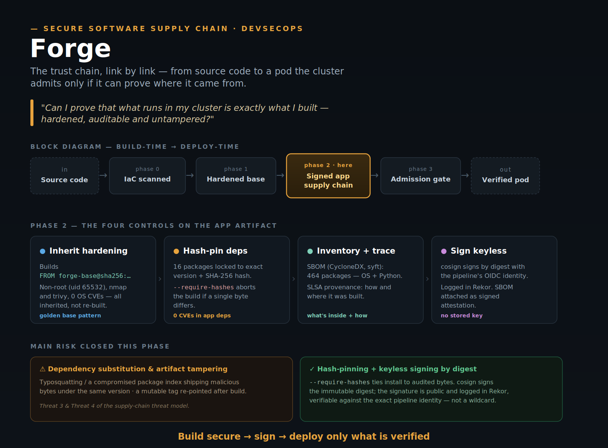
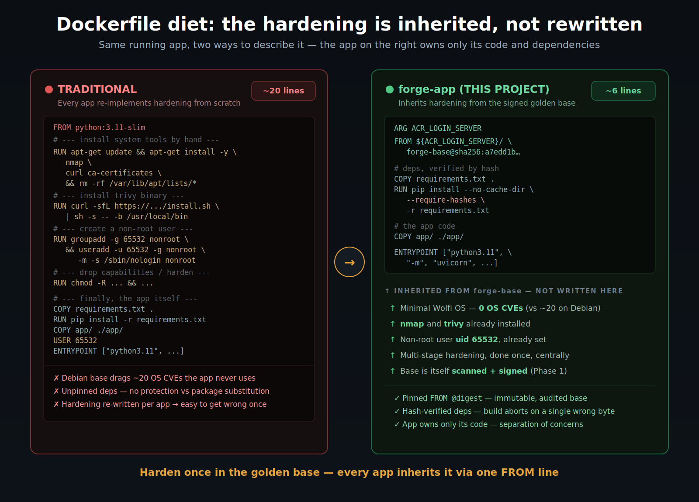
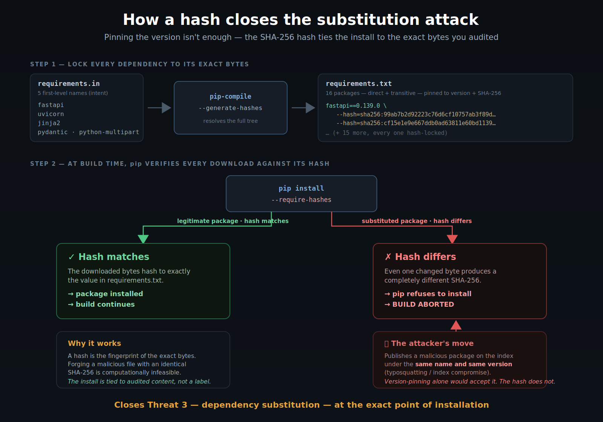
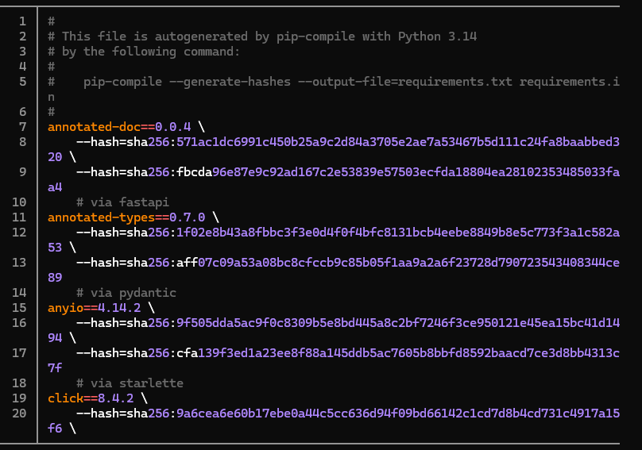
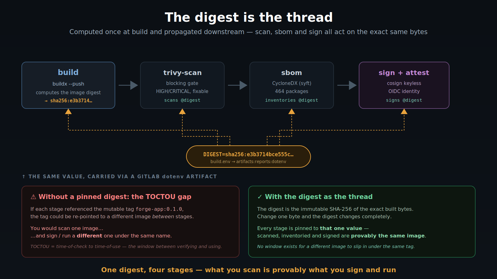
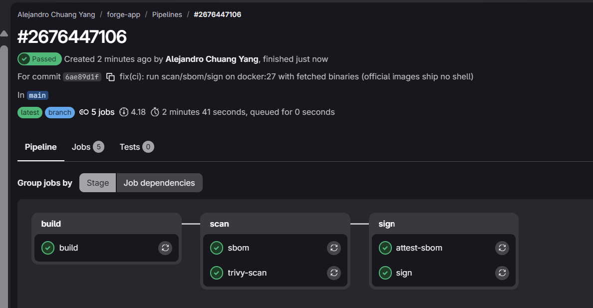
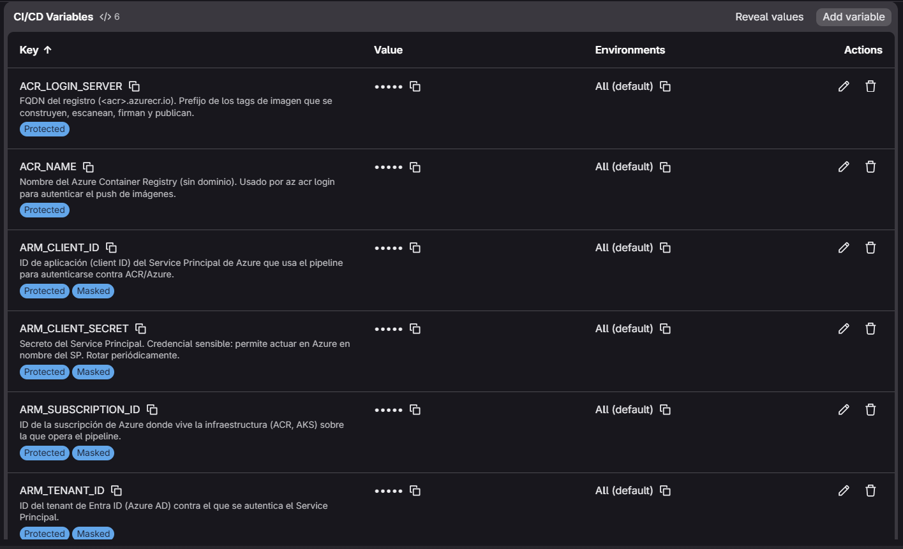
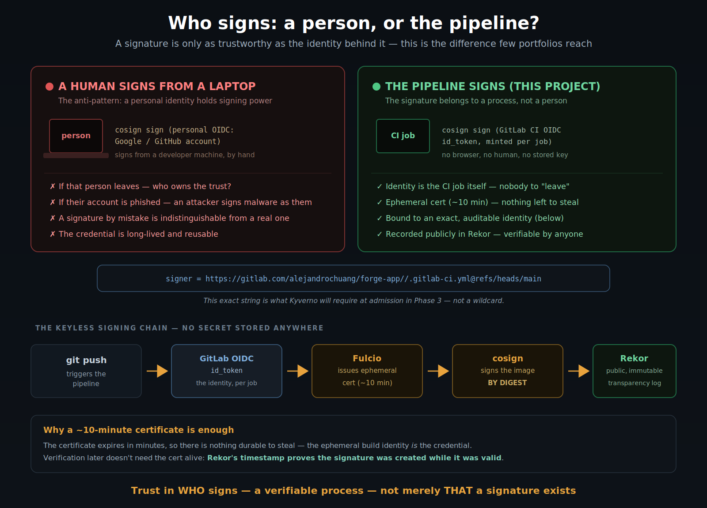
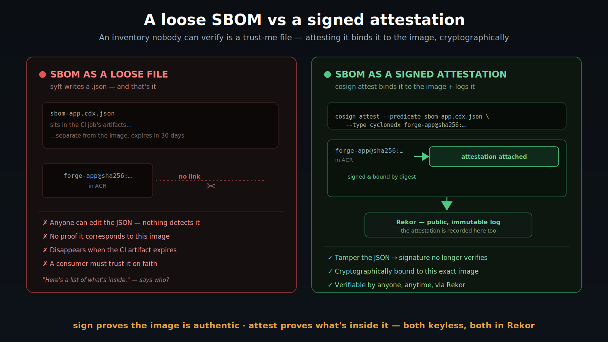

# forge-app · Phase 2 — Signed application supply chain

**Supply-chain security for a real application, end to end:** SecurityScanService (FastAPI) built on a hardened golden base, with **dependencies pinned by hash**, a full **SBOM + SLSA provenance**, and a **keyless signature produced by the pipeline itself** (Sigstore: OIDC → Fulcio → Rekor) — every artifact cryptographically verifiable, with **no signing secret to manage**.


*The end-to-end trust chain. Phase 2 is the application's turn to enter the factory: it inherits the hardened base, pins its dependencies by hash, and ships with an SBOM, provenance and a keyless signature.*

> **The 10-second version:** the app inherits hardening from a signed base (`FROM forge-base@sha256:…`), installs **16 dependencies locked to exact version + SHA-256 hash** (`0` CVEs in app deps, `0` in the OS), and ships **signed by digest, logged in Rekor** — verifiable against the *exact pipeline identity* that built it. Build-time trust, closed for the artifact that actually runs.

**Mitigated risks:**

- **Dependency substitution → closed at install time:** a malicious package published under the same version is rejected because its bytes don't match the pinned hash.
- **Artifact tampering / mutable tags → eliminated:** everything is scanned, signed and inherited **by immutable digest**, not by a re-pointable tag.
- **Personal signing credentials → removed:** the signature belongs to the pipeline's ephemeral OIDC identity — there is no long-lived key or human account that can sign.
- **"What's inside / how was it built?" → answered as signed artifacts:** SBOM (contents) and SLSA provenance (origin), both attached and verifiable.

---

## Key results

| Dimension | Industry default | `forge-app` (this project) |
|---|---|---|
| Base image | `python:3.11-slim` (Debian, ~20 inherited OS CVEs) | `FROM forge-base@sha256:…` — hardened Wolfi, **0 OS CVEs** |
| Dependencies | unpinned `requirements.txt` | **version + SHA-256 hash**, 16 packages incl. transitives |
| CVEs in app dependencies | unknown | **0** (`--require-hashes` at build, Trivy gate) |
| Runs as | root | **non-root (uid 65532)**, inherited from base |
| Inventory | none | **SBOM CycloneDX — 464 packages** (OS + Python) |
| Provenance | none | **SLSA attestation** at build |
| Signature | none | **keyless, by digest, pipeline identity, logged in Rekor** |
| Base reference | mutable tag | **immutable digest** + OCI `base.digest` label |

The only 2 HIGH findings in the image live in the **bundled `trivy` binary inherited from the base** — not in the OS, not in the app, not in the dependencies. Both are formally excepted with written justification (see [Vulnerability policy](#vulnerability-policy-fix--exception--never-silence)). The point: the app's own supply chain scans **completely clean**, and the residual risk is inherited, explained and attributable.

---

## Why this matters

Phase 1 answered *"is my base image the one I built — hardened and untampered?"*. Phase 2 answers the harder question for the artifact that **actually runs in production**: *"is the application image exactly what I built — with a known inventory, from a known base, signed by a process I can point to?"*

The industry default is `FROM python:3.11-slim`, `pip install -r requirements.txt` (unpinned), and no signature. This project replaces every link of that chain with a verifiable one — and does it the way mature platform teams do: hardening is **inherited**, not re-implemented per app.

---

## What gets built: a tiny Dockerfile

The whole thesis of this phase is visible in the size of the Dockerfile. Because the base carries the weight — Wolfi, non-root, `nmap`, `trivy` — the app's Dockerfile only has to describe what is *its own*: its dependencies and its code.


*Same running app, two ways to describe it. The traditional Dockerfile (left) re-implements hardening from scratch and drags 20 OS CVEs; the app's Dockerfile (right) inherits all of it from the signed golden base via a single `FROM` line.*

**Key Code — `Dockerfile`**

```dockerfile
# 🛡️ DEFENSE: inherit from the hardened base by IMMUTABLE DIGEST (not tag).
# ARG before FROM lets us parameterize the registry without hardcoding it in git.
ARG ACR_LOGIN_SERVER
FROM ${ACR_LOGIN_SERVER}/forge-base@sha256:a7edd1bb6460f0e83f3ea0b959283d381688417eb6669eefe96b2d795a9a24f0

# OCI provenance metadata: human-readable tag + the exact base digest.
LABEL org.opencontainers.image.title="securityscanservice" \
      org.opencontainers.image.base.name="forge-base:0.1.0" \
      org.opencontainers.image.base.digest="sha256:a7edd1bb6460f0e83f3ea0b959283d381688417eb6669eefe96b2d795a9a24f0"

WORKDIR /app

# 🛡️ DEFENSE: install ONLY production deps, with hash verification.
# --require-hashes fails the build if ANY package lacks a matching hash.
COPY requirements.txt .
RUN pip install --no-cache-dir --require-hashes -r requirements.txt

COPY app/ ./app/
EXPOSE 8000

# Healthcheck uses urllib (already in the base's Python) — no extra dependency.
HEALTHCHECK --interval=30s --timeout=3s --start-period=5s --retries=3 \
  CMD ["python3.11", "-c", "import urllib.request,sys; sys.exit(0 if urllib.request.urlopen('http://127.0.0.1:8000/').status==200 else 1)"]

# 🛡️ DEFENSE: the base already defines USER 65532. We never reintroduce root.
ENTRYPOINT ["python3.11", "-m", "uvicorn", "app.main:app", "--host", "0.0.0.0", "--port", "8000"]
```

**What it does and why it matters.** Everything security-relevant is *inherited*: there is no `apt-get install`, no user creation, no `USER root` anywhere — the non-root `uid 65532`, `nmap`, `trivy` and the minimal Wolfi OS all come from `FROM forge-base`. The app contributes only two things: its hash-verified dependencies and its code. `--require-hashes` turns the pinned `requirements.txt` into an enforced guarantee (below), and pinning the base by `@sha256:…` rather than a tag means the app is always built on the exact base that was audited and signed in Phase 1 — a tag could be silently re-pointed, a digest cannot.

> **What does "inherit hardening" mean?** Instead of every application image re-doing the
> security work (minimal OS, dropping root, installing tools), the hardening is done **once**
> in a central *golden base image* (`forge-base`, Phase 1). Each app then starts `FROM` that
> base and gets all of it for free. Hardening becomes a property you inherit, not a checklist
> you re-run — and can't forget to run — per app.

---

## Hash-pinning: the dependency lockdown

This is the control that resolves technical debt carried over from a prior project (an unpinned `requirements.txt`) and closes one of the nastiest supply-chain vectors.


*Pinning the version isn't enough. `pip-compile --generate-hashes` locks every package to its exact SHA-256; at build time `--require-hashes` rejects any download whose bytes differ — so a malicious package published under the same version bounces off the hash.*

**Key Code — `scripts/pin-deps.sh`**

```bash
# 🛡️ DEFENSE: compile first-level deps into an exact, hash-locked manifest.
# --generate-hashes records the SHA-256 of EVERY package (direct + transitive).
pip-compile --generate-hashes --output-file=requirements.txt requirements.in
pip-compile --generate-hashes --output-file=requirements-dev.txt requirements-dev.in
```

This turns five declared names into a fully locked manifest:

**Key Code — `requirements.txt` (excerpt)**

```
fastapi==0.139.0 \
    --hash=sha256:99ab7b2d92223c76d6cf10757ab3f89d45b38267fc20b2a136cf02f6beac3145 \
    --hash=sha256:cf15e1e9e667ddb0ad63811e60bd11390d1aac838ca4a7a23f421807b2308189
    # via -r requirements.in
# … 15 more packages, every one pinned to an exact version + SHA-256
```


*The compiled `requirements.txt`: every package pinned to an exact version and its SHA-256 hash(es). The `# via …` comments trace each transitive dependency back to the top-level package that pulled it in — `annotated-doc` via fastapi, `anyio` via starlette, and so on.*

**What it does and why it matters.** Pinning the *version* (`fastapi==0.139.0`) protects against surprise updates, but not against someone substituting that package on the index with a malicious build under the *same* version (typosquatting or a compromised index). The **hash** ties the install to the exact bytes that were audited: `pip install --require-hashes` recomputes the SHA-256 of every download and **aborts the build if a single byte differs**. Forging a malicious file with an identical SHA-256 is computationally infeasible, so the install is bound to audited content, not to a mutable label.

> **Version-pin vs hash-pin — what's the difference?** A version pin says *"give me
> `fastapi` 0.139.0"* — and trusts the index to hand back the real one. A hash pin says
> *"give me the file whose SHA-256 is `99ab7b…`"* — and verifies it byte-for-byte. The first
> trusts a name; the second trusts content. Only the second survives a compromised package index.

The prod/dev split matters too: `pytest` and `httpx` live in a separate `requirements-dev.txt` that **never enters the image**. Fewer packages in the deployed artifact means a smaller attack surface and fewer potential CVEs.

---

## Pipeline architecture

Every push triggers a GitLab CI pipeline of five chained stages acting as gates: if one fails, nothing downstream runs. The image **digest** (`sha256:…`) is computed once at build and propagated to every later stage, so the exact same bytes are scanned, inventoried and signed.


*The digest computed at build travels — via a GitLab `dotenv` artifact — to scan, sbom and sign. Every stage is pinned to that one value, closing the TOCTOU window where a mutable tag could point somewhere else between "what I checked" and "what I run".*

| Stage | Control | Guarantee |
|---|---|---|
| `build` | Build on hardened base + SLSA provenance, push by digest | Traceability: how and where it was built |
| `trivy-scan` | Trivy as a blocking gate (`--exit-code 1`, fixable-only) | No image with a remediable HIGH/CRITICAL CVE reaches the registry |
| `sbom` | CycloneDX inventory (syft) | Instant answer to "does this new CVE affect us?" |
| `sign` | Keyless signing with the pipeline's OIDC identity | Authenticity + integrity, with **no stored key** |
| `attest-sbom` | SBOM attached as a signed attestation | The inventory itself is cryptographically verifiable |


*The five-stage pipeline, green — the app image built, scanned, inventoried, signed and its SBOM attested, all on every push.*

CI secrets are stored **Protected + Masked** — the Service Principal credentials never appear in the pipeline YAML or in job logs.


*The Azure Service Principal and ACR coordinates live as Protected + Masked CI/CD variables, injected at run time — never committed to the repository.*

---

## Building against real cloud: the fixes that mattered

A first CI pipeline against real cloud almost never passes on the first run. Three fixes are worth calling out because they encode judgment, not just syntax.

### Authenticating to the registry without Azure CLI

**Key Code — `.gitlab-ci.yml` (`build.before_script`)**

```yaml
before_script:
  # 🛡️ DEFENSE: authenticate to ACR with the Service Principal, no Azure CLI.
  # 1) Pipe the SP secret into `docker login` via stdin (never as an argument →
  #    stays out of the process list and shell history). ACR is a standard OCI
  #    registry, so Docker authenticates to it natively — no `az` needed.
  - echo "$ARM_CLIENT_SECRET" | docker login "$ACR_LOGIN_SERVER" -u "$ARM_CLIENT_ID" --password-stdin

  # 2) Create a BuildKit builder on the `docker-container` driver — the only driver
  #    that supports SLSA provenance + SBOM attestations. `network=host` makes the
  #    nested BuildKit share the dind host network (normal MTU) so the TLS handshake
  #    to ACR doesn't fragment. `--use` sets it as the active builder.
  - docker buildx create --driver docker-container --name forgebuilder --driver-opt network=host --use

  # 3) Boot the builder now (pull the BuildKit image, start the container) so the
  #    first real build doesn't pay the cold-start cost — and fail fast here if the
  #    builder can't come up.
  - docker buildx inspect --bootstrap
```

**What it does and why it matters.** An ACR is a standard OCI registry, so Docker can authenticate to it natively — there's no reason to install the whole Azure CLI (which doesn't exist as a package on the Alpine-based `docker:27` image) just to run `az acr login`. `--password-stdin` reads the secret from a pipe rather than an argument, so it never lands in the process list or shell history. Fewer dependencies, faster job, less to break.

### Fixing a deterministic TLS timeout to the registry

The build failed — repeatably — at `load metadata` for the base image with `TLS handshake timeout`, even though the `docker login` seconds earlier succeeded.

**Key Code — the fix (in the `buildx create` above)**

```yaml
  - docker buildx create --driver docker-container --name forgebuilder --driver-opt network=host --use
```

**What it does and why it matters.** The `--provenance`/`--sbom` attestations require the `docker-container` driver, which runs BuildKit in a *nested* container inside dind. That nested network had a reduced MTU that fragmented the TLS handshake to ACR — so it failed every time, not intermittently. `--driver-opt network=host` makes BuildKit share the dind host network (normal MTU), and the handshake completes. The lesson was in the diagnosis: a cheap experiment (retry ×3, no code change) proved the failure *deterministic* before applying the fix — distinguishing a real bug from transient cloud latency.


> **Why `buildx` and not plain `docker build`?** The classic builder cannot produce
> attestations — `--provenance` and `--sbom` are simply unsupported on the `docker` driver
> (that was one of the pipeline failures above). `buildx` runs on BuildKit, which generates
> the SLSA provenance and SBOM at build time and attaches them to the image. The clean digest
> from `imagetools inspect` and faster, cache-aware builds come along for free — but the
> reason it's *required* here is the attestations.

### Extracting a clean digest from a multi-arch, attested image

**Key Code — `.gitlab-ci.yml` (`build.script`)**

```bash
# An image built WITH attestations exposes several digests; take the manifest-list one.

# 1) Ask the registry for the image's manifest digest(s). Because the image carries
#    provenance + SBOM, this returns SEVERAL sha256 values, one per line.
RAW=$(docker buildx imagetools inspect "${IMAGE_NAME}:${VERSION}" --format '{{.Manifest.Digest}}')

# 2) Keep only strings shaped like a real digest (sha256: + 64 hex chars), then take
#    the first line — the manifest list. `sed -n '1p'` reads all input and prints line 1,
#    so it never closes the pipe early (which is what made `head` blow up with SIGPIPE).
DIGEST=$(printf '%s\n' "$RAW" | grep -oE 'sha256:[a-f0-9]{64}' | sed -n '1p')

# 3) Fail loudly if nothing was captured, instead of writing an empty/broken value.
if [ -z "$DIGEST" ]; then echo "ERROR: empty digest"; exit 1; fi

# 4) Write it as KEY=value into build.env; GitLab loads this into later stages (dotenv),
#    so scan/sbom/sign all operate on this exact digest.
printf 'DIGEST=%s\n' "$DIGEST" > build.env   # exported to later stages via dotenv
```

**What it does and why it matters.** Adding provenance + SBOM turns the image into a manifest *list* (image + attestations), so `imagetools inspect` returns **multiple** digests. Capturing all of them produced an invalid `dotenv` artifact; selecting the first (the manifest list) with `sed -n '1p'` — rather than `head`, which triggers `SIGPIPE` under `pipefail` — yields exactly one clean `sha256:…`. It's a detail that only surfaces on a *full* supply-chain build, and the `if [ -z … ]` guard fails loudly rather than shipping a broken artifact downstream.

---

## The differentiator: the pipeline is the signer

Signing an artifact is common. Signing it with a **human's personal identity from a laptop** is an anti-pattern — if that person leaves, or their account is phished, or they sign something by mistake, the trust story collapses. This project makes the signature belong to a **process, not a person**.


*Left: a personal identity holding signing power — long-lived, reusable, tied to one human. Right: the pipeline's ephemeral OIDC identity, bound to an exact, auditable path. Below: the keyless chain — git push → GitLab OIDC id_token → Fulcio (ephemeral cert) → cosign signs by digest → Rekor.*

**Key Code — `.gitlab-ci.yml` (`.sigstore_id_token` + `sign` + `attest-sbom`)**

```yaml
# Reusable snippet: tells GitLab to mint an OIDC token that Fulcio accepts as
# the pipeline's identity. Both signing jobs pull it in via `extends`.
.sigstore_id_token:
  id_tokens:
    SIGSTORE_ID_TOKEN:
      aud: sigstore

# JOB 1 — sign the image itself.
sign:
  stage: sign
  extends: .sigstore_id_token
  image: docker:27
  services: [ docker:27-dind ]
  before_script:
    # cosign's official image has no shell, so fetch the binary onto docker:27
    - apk add --no-cache curl
    - curl -sfL "https://github.com/sigstore/cosign/releases/download/v2.4.1/cosign-linux-amd64" -o /usr/local/bin/cosign
    - chmod +x /usr/local/bin/cosign
    # authenticate to ACR (the signature is pushed next to the image)
    - echo "$ARM_CLIENT_SECRET" | docker login "$ACR_LOGIN_SERVER" -u "$ARM_CLIENT_ID" --password-stdin
  script:
    # 🛡️ DEFENSE: keyless signing — cosign uses the GitLab id_token as its
    # identity before Fulcio. There is no key stored anywhere.
    - cosign sign --yes "${IMAGE_NAME}@${DIGEST}"

# JOB 2 — sign the SBOM as an attestation and attach it to the same image.
attest-sbom:
  stage: sign
  extends: .sigstore_id_token
  # waits for build (the digest) and sbom (the .json) and pulls their artifacts
  needs: [ { job: build, artifacts: true }, { job: sbom, artifacts: true } ]
  image: docker:27
  services: [ docker:27-dind ]
  before_script:
    # same shell-less-image workaround as the sign job
    - apk add --no-cache curl
    - curl -sfL "https://github.com/sigstore/cosign/releases/download/v2.4.1/cosign-linux-amd64" -o /usr/local/bin/cosign
    - chmod +x /usr/local/bin/cosign
    - echo "$ARM_CLIENT_SECRET" | docker login "$ACR_LOGIN_SERVER" -u "$ARM_CLIENT_ID" --password-stdin
  script:
    # 🛡️ DEFENSE: attach the SBOM as a SIGNED attestation, not a loose CI artifact.
    - cosign attest --yes --predicate sbom-app.cdx.json --type cyclonedx "${IMAGE_NAME}@${DIGEST}"
```

**What it does and why it matters.** The `id_tokens` block makes GitLab issue a signed OIDC token (audience `sigstore`) for the job. `cosign` picks it up automatically, presents it to Fulcio, and receives a short-lived certificate to sign with — no `cosign.key` file, no secret in CI variables, nothing to rotate. The signer's identity *is* the CI job, which is why the signature can later be verified against that exact identity. The `attest-sbom` job goes one step further: it attaches the SBOM as a **signed** attestation, so the inventory travels with the image and can be verified cryptographically rather than trusted as a loose file. (Both jobs download the cosign binary onto `docker:27` because the official cosign image ships without a shell, which GitLab needs to run the script.)

> **What is "keyless" signing?** Traditional signing needs a long-lived private key — a secret
> to store, rotate and protect, and one that lets an attacker sign malware as you if it leaks.
> *Keyless* (Sigstore) removes the secret: the signer proves *who it is* with a short-lived
> identity, gets a ~10-minute certificate from Fulcio, signs, and the signature is recorded in
> Rekor. The certificate then expires — there is nothing durable left to steal.

> **Why sign by digest, not by tag?** A tag (`forge-app:0.1.0`) is a human-friendly label that
> can be re-pointed to a different image later. A digest (`forge-app@sha256:…`) is the SHA-256
> of the exact bytes — change one byte and it changes completely. Signing the digest binds the
> signature to the precise image that was audited, so nobody can slip a different one under the
> same name. You sign the content, not the label.

---

## Verify it yourself

The signature is public — no need to take my word for it. Anyone can confirm the image was signed **by this exact pipeline**, not merely that *a* signature exists.

**Key Code — end-to-end verification**

```bash
APP_DIGEST=$(docker buildx imagetools inspect "$ACR_LOGIN_SERVER/forge-app:0.1.0" \
  --format '{{.Manifest.Digest}}' | grep -oE 'sha256:[a-f0-9]{64}' | sed -n '1p')

# Verify the signature against the EXACT pipeline identity (not a wildcard).
cosign verify \
  --certificate-identity-regexp "https://gitlab.com/alejandrochuang/forge-app//.gitlab-ci.yml.*" \
  --certificate-oidc-issuer "https://gitlab.com" \
  "$ACR_LOGIN_SERVER/forge-app@$APP_DIGEST" \
  | jq '.[0].optional.Subject, .[0].optional.Issuer'

# Verify the SBOM attestation is signed by the same identity.
cosign verify-attestation \
  --certificate-identity-regexp "https://gitlab.com/alejandrochuang/forge-app//.gitlab-ci.yml.*" \
  --certificate-oidc-issuer "https://gitlab.com" \
  --type cyclonedx "$ACR_LOGIN_SERVER/forge-app@$APP_DIGEST"
```

It returns the signer's identity and issuer:

```
"https://gitlab.com/alejandrochuang/forge-app//.gitlab-ci.yml@refs/heads/main"
"https://gitlab.com"
```

**What it does and why it matters.** The key is verifying against the *exact* pipeline path, not a `.*` wildcard. A wildcard only proves "there is some valid signature"; the exact identity proves "it was signed by *this* pipeline, on `main`, and nobody else". That distinction is what turns a signature from informational into an enforceable control — and it is the very same check the Kyverno admission gate will run in-cluster in **Phase 3** to accept or reject images at deploy time.

---

## SBOM and SLSA provenance: what's inside and how it was built

A signature proves the image is *authentic and untampered*; a consumer asks two more questions: **what does it contain?** and **how was it built?** The pipeline answers both, as machine-readable artifacts generated on every push.

**Key Code — `.gitlab-ci.yml` (`build` and `sbom`)**

```yaml
# in the build job — provenance AND an in-toto SBOM are generated and attached at build time
docker buildx build --provenance=true --sbom=true --push .

# the sbom job — full CycloneDX inventory of the SAME digest, kept as an artifact
syft "${IMAGE_NAME}@${DIGEST}" -o cyclonedx-json=sbom-app.cdx.json
```

**What it does and why it matters.** `--provenance=true` emits a SLSA provenance attestation (which commit, which pipeline, which parameters); `--sbom=true` and the `syft` job produce a component inventory of the **exact same digest** that was built and scanned. The resulting SBOM (464 packages) captures *both* layers of the artifact: the OS packages inherited from the base **and** the hash-pinned Python dependencies — the complete inventory of what actually ships. Together with the signature, these close the visibility gap: origin is verifiable (provenance) and contents are auditable (SBOM). An image without them is a black box trusted on faith.

### Signing the SBOM: from a trust-me file to a verifiable claim

Generating the SBOM is half the job. A `.json` sitting in the CI artifacts is a **trust-me file**: anyone can edit it, it isn't tied to the image, and it vanishes when the artifact expires. The `attest-sbom` stage fixes that.


*Left: syft writes an inventory that lives beside the image, unlinked and unverifiable. Right: `cosign attest` binds that inventory to the image by digest, signs it with the pipeline's identity, and records it in Rekor.*

**Key Code — `.gitlab-ci.yml` (`attest-sbom`)**

```yaml
# 🛡️ DEFENSE: attach the SBOM as a SIGNED attestation, not a loose CI artifact.
- cosign attest --yes --predicate sbom-app.cdx.json --type cyclonedx "${IMAGE_NAME}@${DIGEST}"
```

**What it does and why it matters.** There are two distinct cosign verbs, and the difference is the whole point: **`cosign sign`** signs the *image* ("this image is authentic"), while **`cosign attest`** signs a *claim about* the image — here, the SBOM ("this inventory belongs to this image, and this pipeline vouches for it"). Attesting binds the SBOM to the exact digest and records it in Rekor, so a consumer can later ask *"does this image really contain these 464 packages?"* and **verify it cryptographically** — instead of trusting a JSON that could have been altered. Tamper with one byte of the inventory and the attestation stops verifying. This is genuinely new in Phase 2: Phase 1 signed its base image, but it did not attest its SBOM.

> **What is an attestation?** A signature answers *"is this artifact authentic?"*. An
> attestation answers *"is this **statement about** the artifact authentic?"* — where the
> statement can be an SBOM, a provenance record, a test result, anything. cosign wraps the
> statement in the in-toto format, signs it keyless (same OIDC → Fulcio → Rekor flow as the
> image signature), and attaches it to the image by digest. The inventory stops being a loose
> document and becomes a verifiable, tamper-evident claim that travels *with* the image.

---

## Hardening the inheritance: pin the base by digest

Once the base is signed and stable, the app pins its `FROM` to the base's **digest** rather than its tag — the same "mutable tag vs immutable digest" lesson, now applied to image inheritance.

**Key Code — `Dockerfile` + OCI label**

```dockerfile
# from a mutable tag:
#   FROM ${ACR_LOGIN_SERVER}/forge-base:0.1.0
# to an immutable digest:
FROM ${ACR_LOGIN_SERVER}/forge-base@sha256:a7edd1bb6460f0e83f3ea0b959283d381688417eb6669eefe96b2d795a9a24f0

LABEL org.opencontainers.image.base.name="forge-base:0.1.0" \
      org.opencontainers.image.base.digest="sha256:a7edd1bb6460f0e83f3ea0b959283d381688417eb6669eefe96b2d795a9a24f0"
```

**What it does and why it matters.** Pinning by digest guarantees the app is always built on **exactly** the base that was audited and signed — if someone re-points the `forge-base:0.1.0` tag to a compromised image, the app's build is unaffected. `org.opencontainers.image.base.digest` is a standard OCI field, so the provenance metadata states that truth rather than contradicting it (the human-readable `base.name` stays for legibility). **Trade-off:** updating the base now requires bumping the digest by hand; in production this is automated with digest-bump tooling (renovate/dependabot for images). Documented, not hidden.

---

## Vulnerability policy: fix > exception > never silence

The Trivy gate blocks only *fixable* findings; anything excepted must carry a written, contextual justification. This is the difference between *managing* residual risk and *silencing* it.

**Key Code — `.trivyignore`**

```gitignore
# =============================================================================
# .trivyignore — JUSTIFIED exceptions. Every CVE is read, its exploitability
# reasoned IN THIS context, and documented. Never silenced. Reviewed each rebuild.
#
# Both CVEs live in the 'trivy' binary INHERITED from forge-base — NOT in the
# Wolfi OS nor in the app's Python dependencies (both scan at 0 CVEs). The binary
# is inert at rest: the app invokes it in a controlled way (allowlist: trivy
# against ubuntu:latest). No fixed upstream binary published at build time.
# =============================================================================

CVE-2026-50151  # oras-go: credential forwarding via unvalidated Location header; inert in the base image
CVE-2026-39822  # Go stdlib os.Root symlink traversal; inert in the base image
```

**What it does and why it matters.** Trivy reads only the two CVE IDs; everything else is the audit trail. Each entry records *what* the CVE is, *why* it isn't exploitable in this specific context (both live in a packaged tool that sits inert in the image), *why* it can't be fixed today (no patched upstream binary), and *when* to revisit. A reviewer opening this file sees judgment, not a mute button — and note these are **inherited** from the base: the app's own dependencies add zero findings.

---

## Production debugging: making the pipeline converge

| Failure | Diagnosis → fix |
|---|---|
| `azure-cli: no such package` | Not on Alpine (runner image) → authenticate to ACR with `docker login` + Service Principal, drop Azure CLI |
| `Attestation is not supported for the docker driver` | `--provenance`/`--sbom` need the `docker-container` driver → `buildx create --driver docker-container` |
| `TLS handshake timeout` to ACR (deterministic) | MTU mismatch in the nested BuildKit network → run BuildKit with `--driver-opt network=host` |
| `build.env: Invalid Format` (dotenv 400) | `imagetools inspect` on an attested image returns **multiple digests** → select the manifest-list digest only |
| `exit 141` (SIGPIPE) | `grep \| head` under `pipefail` kills the upstream command → capture to a variable, use `sed -n '1p'` |
| `exec: "sh" not found` in scan/sbom/sign | Official trivy/syft/cosign images ship no shell → run on `docker:27`, fetch the binary at job start |

> The real learning wasn't the YAML — it was **distinguishing a configuration error** (fixed in the file) **from a transient infrastructure failure** (made resilient with retries). The TLS timeout *looked* transient; a cheap experiment proved it deterministic *before* the complex fix. A pipeline isn't written; it's *made to converge* — and knowing which kind of failure you're staring at is what makes that convergence fast instead of superstitious.

---

## Risk management (what was *not* fixed)

An honest model beats an all-green one. Residual risk, identified and documented:

- 🟡 **2 HIGH CVEs in the bundled trivy binary** (`CVE-2026-50151`, `CVE-2026-39822`) — inherited from the base, inert at rest, no fixed upstream binary yet. Excepted in `.trivyignore` with written justification, re-reviewed on every rebuild.
- 🟡 **Digest pinning is manual** — updating the base requires bumping the digest by hand. Production would automate this with digest-bump tooling (renovate/dependabot for images).
- 🟡 **Broad Service Principal** (Contributor, inherited from Phase 0) — known debt; production would scope it to the resource group.
- 🔵 **Out of scope for this phase:** CI runner compromise (production: ephemeral runners, higher SLSA level), runtime security (eBPF/Tetragon, a later project), and application logic — SSRF and argument-injection in `/api/scan` were covered by SAST in a prior project. This phase is supply chain, not AppSec.

---

## Cost engineering

This phase runs entirely at **build time**, so the AKS node from Phase 0 stays **stopped** (`az aks stop`) — it isn't needed until the Phase 3 admission gate. Compute is the real cost (~$1–1.50/day); ACR Basic is marginal (~$0.17/day) and stays alive to hold the signed image, its SBOM and the signature's Rekor record. Stop what's expensive, keep what's valuable, document the trade-off.

---

## How to reproduce

Local proof-of-concept (the pipeline automates all of this on every push, and is the source of truth):

```bash
export ACR_LOGIN_SERVER=$(cd ../forge-infra && terraform output -raw acr_login_server)

make pin      # compile requirements.txt with --generate-hashes
make build    # build the app image on the hardened base (provenance + sbom)
make scan     # blocking Trivy gate + SBOM generation
make test     # run the container, assert HTTP 200 and non-root uid 65532
```

> **Note — local vs CI:** the local scripts build and scan by **tag** for a fast check; the pipeline builds, scans and signs by **digest**. Signing is only done in CI, with the pipeline's identity — never locally with a personal one (that was a deliberate decision: the only legitimate signer in this architecture is the pipeline, which is what the Phase 3 admission policy requires).

---

## Stack

`Chainguard Wolfi` (inherited base) · `pip-tools` (`--generate-hashes`) · `Docker Buildx` (docker-container driver, host networking, SLSA provenance) · `Trivy` · `Syft` (SBOM CycloneDX) · `cosign` / `Sigstore` (Fulcio + Rekor) · `GitLab CI` (OIDC `id_tokens`) · `Azure Container Registry`

## Repository layout

```
forge-app/
├── Dockerfile          # inherits FROM forge-base@sha256:… (non-root, hash-verified deps)
├── requirements.in     # first-level deps (declared intent)
├── requirements.txt    # compiled: exact version + SHA-256 hash, all transitives
├── requirements-dev.in # dev tooling — never enters the image
├── .trivyignore        # CVE exceptions — each one justified in writing
├── .dockerignore
├── .gitlab-ci.yml      # build → trivy-scan → sbom → sign → attest-sbom (keyless)
├── Makefile            # local convenience (pipeline is the source of truth)
├── app/                # SecurityScanService (FastAPI)
├── scripts/            # pin-deps / build / scan
└── docs/img/           # diagrams and evidence for this README
```

## Project context

**Phase 0** (`forge-infra`): Azure foundations with Terraform — AKS, ACR, Workload Identity, remote state, Checkov IaC scanning. ✅
**Phase 1** (`forge-images`): hardened, signed golden base image (Wolfi, Trivy, keyless cosign). ✅
**Phase 2** (this repo): the application supply chain — inherits `FROM forge-base`, hash-pinned deps, SBOM + provenance + keyless signature of the app image. ✅
**Phase 3** (next): admission control (Kyverno) on AKS — the cluster rejects any image not signed by the expected pipeline identity. The signature verified here is exactly what the policy will enforce.
