# forge-app · Phase 3 — Admission gate: the cluster enforces the signature

**Deploy-time trust, enforced.** Kyverno runs as a Kubernetes admission controller on AKS and verifies, **before a pod is ever scheduled**, that its image was signed keyless by the *exact* pipeline identity that built it (Sigstore: OIDC → Fulcio → Rekor). A signed image is admitted and **pinned to its verified digest**; an unsigned image is **rejected in admission — the pod never comes into existence.**

> **The 10-second version:** Phases 1–2 *produce* cryptographic evidence. This phase makes the cluster **demand it.** A `verifyImages` policy — rolled out `Audit → Enforce` — admits only images signed by `.gitlab-ci.yml@refs/heads/main`, rewrites every tag to its verified digest (closing the TOCTOU window — the gap where a tag could be swapped between check and run), and actively rejects everything else. The difference between *"I have a signature"* and *"my platform requires one."*

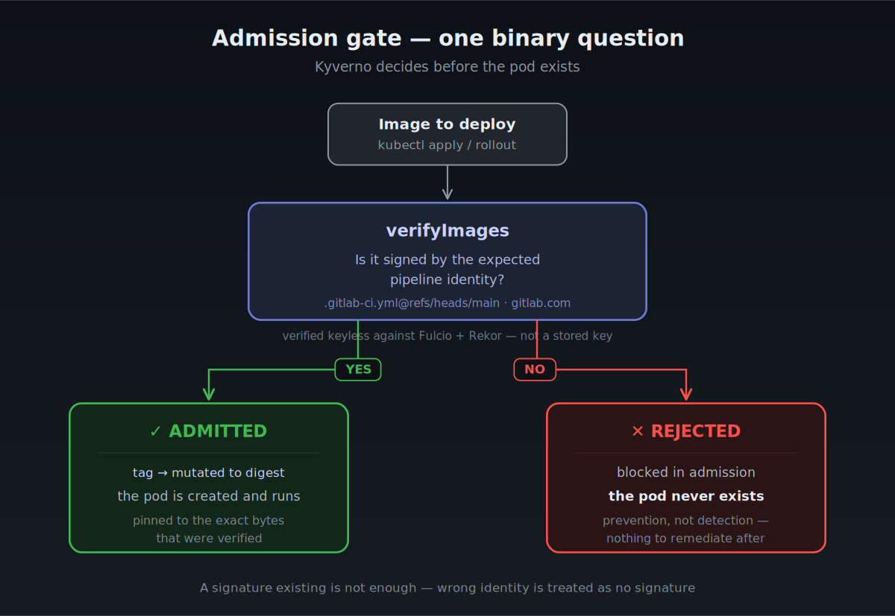

### Mitigated risks

- 🔴 **Unverified image reaches production** → the cluster refuses to schedule any image not signed by the expected pipeline identity. Verification is the platform default, not a step someone remembers.
- 🟠 **Mutable tag re-pointed after verification (TOCTOU)** → Kyverno rewrites the tag to the verified digest at admission; the running pod is bound to exact bytes, not a movable label.
- 🟠 **Over-privileged verifier** → Kyverno reads the registry with a scoped, read-only, single-repository token — not the CI Service Principal.
- 🟡 **A blocking policy shipped cold breaks live workloads** → `Audit → Enforce` rollout: observe first, promote only on evidence, with a one-command path back.

---

## What is an admission controller?

> A Kubernetes *admission controller* sits inside the API server's request path. Every time something asks to create a Pod, the API server pauses and asks the controller for a verdict **before the object is persisted**. Kyverno is a policy-driven admission controller: it evaluates the request against declarative policies and answers *allow* or *deny* (and can also *mutate* the request).
>
> The mental model that matters: **Kyverno does not watch pods — it intercepts requests.** At the moment it decides, the pod is not a running thing you could inspect or kill. It is an HTTP payload in transit. That single fact is why this is *prevention*, not *detection*.

### Key results

| Dimension | Industry default | `forge` (this phase) |
|---|---|---|
| Deploy-time verification | none — signatures sit unread | **keyless `verifyImages` in admission**, identity-pinned |
| What is trusted | *a* signature exists | signed by **this exact pipeline** (subject + issuer) |
| Image reference at runtime | mutable tag | **mutated to the verified digest** at admission |
| Unsigned image | deploys silently | **rejected — the pod never exists** |
| Policy rollout | Enforce, cold | **Audit → Enforce**, promoted on PolicyReport evidence |
| Verifier credential | admin creds / cluster-wide SP | **ACR scoped token: read-only, 1 repo, 7-day expiry** |
| Verifier failure mode | fail open | **fail closed** (`failurePolicy: Fail`) |

---

## Why this matters: from passive evidence to active control

Everything before this phase is **passive evidence.** Terraform scans, Trivy gates, the SBOM, the cosign signature — they all *produce proof*, but none of them *prevents* anything. An attacker who could create pods in the cluster could deploy any image at all, and the beautiful signatures would sit in the registry, unread.

Admission control is the link that **exercises** the evidence. The API server asks Kyverno before scheduling every pod, and Kyverno cryptographically checks — against Fulcio/Rekor, using the pipeline's OIDC identity rather than a stored key — that the image is exactly what the pipeline built and signed.

> 🔐 **Security reading — where the security actually comes from.** Signing produces evidence; *verification at the gate* is what turns evidence into a control. Phase 3 is the first link in the whole chain that can turn something away.

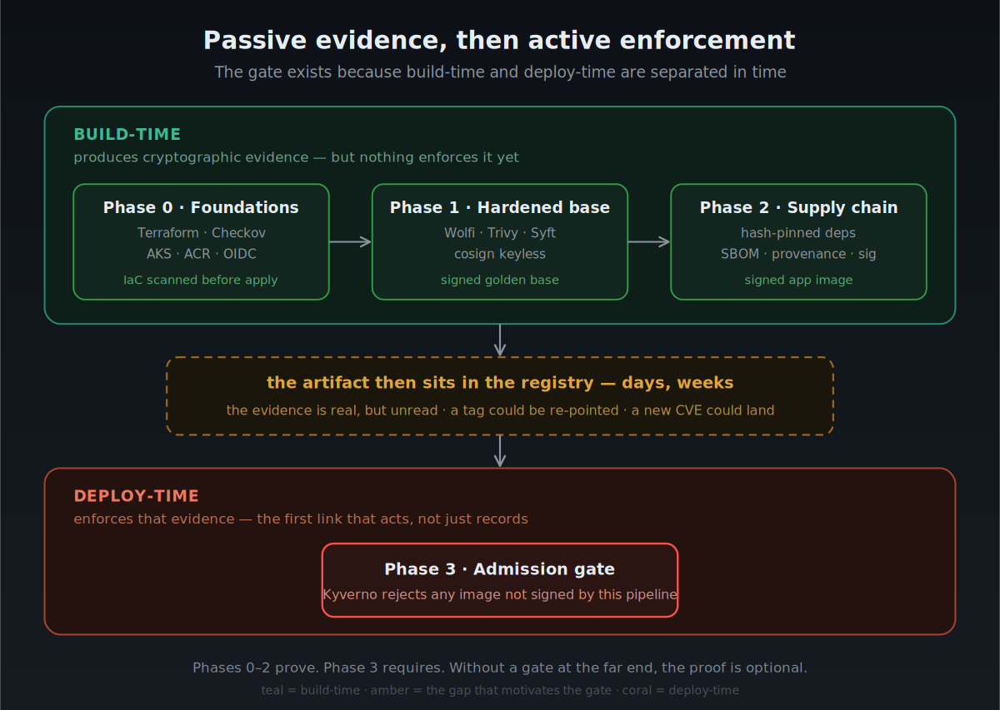

The gap in the middle of that diagram — the days or weeks the artifact waits in the registry — is not decoration. It is exactly where a tag can be re-pointed or a fresh CVE can land. **Section 7 is the story of that gap turning real.**

---

## 1 · The verifier's credential (least privilege, tested under fire)

**The problem.** ACR is private. The natural instinct is *"the node already has `AcrPull` from Phase 0 — let Kyverno use that."* It cannot: Kyverno verifies signatures with **its own OCI client**, which does not inherit the node's managed identity. And the artifact it needs to read is not the image — it is the **signature** (`.sig`), a separate OCI object living in the same repository. So Kyverno needs its own credential, and the question is *how much* credential.

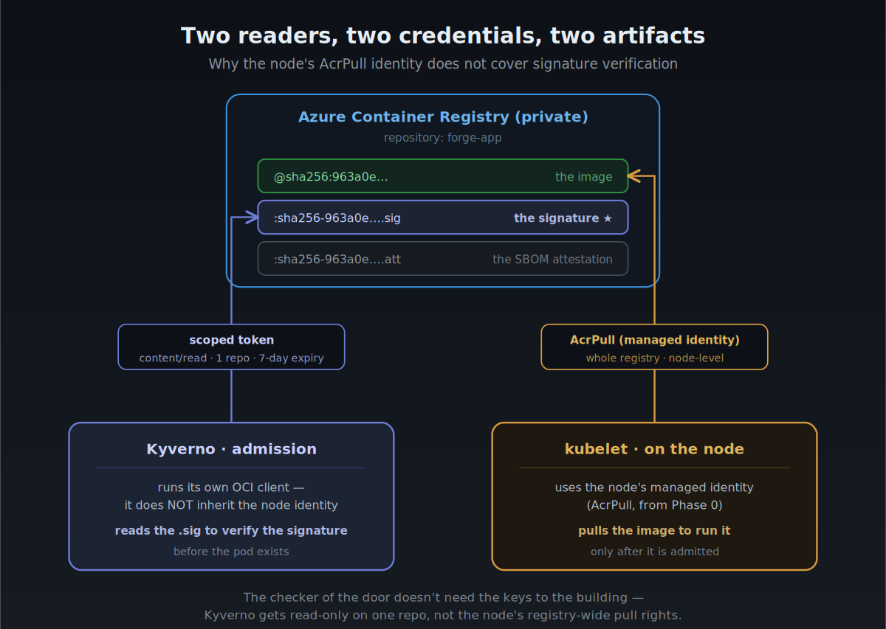

The decision: **not** the CI Service Principal. A scoped ACR token, read-only, on one repository.

```bash
# A repository-scoped ACR token: it can read ONE repo, nothing else in the subscription.
az acr token create \
  --name kyverno-verify \
  --registry "$ACR_NAME" \
  --repository forge-app content/read metadata/read \  # read only; no write, no other repo
  --expiration-in-days 7

# Materialise it as a docker-registry secret in Kyverno's namespace.
kubectl create secret docker-registry acr-kyverno-creds \
  -n kyverno \
  --docker-server="$ACR_LOGIN_SERVER" \
  --docker-username=kyverno-verify \
  --docker-password="$KYVERNO_ACR_PWD"
```

> **Why not reuse the Service Principal?** The SP inherited from Phase 0 is `Contributor` over the whole subscription. Handing that to an in-cluster component so it can *read one signature* is the classic over-privilege anti-pattern — the blast radius if that pod or secret is compromised would be the entire cloud estate. 

**What it does and why it matters.** The token authenticates Kyverno to the private registry with the least authority that still lets it do its job: read the `forge-app` repo. This was validated the hard way — the Azure CLI printed the token password to `stderr`, so it leaked into a log during the session. Because the credential was scoped, the blast radius was *one repository, read-only, for seven days*, instead of subscription-wide write.

> 🔐 **Security reading — least privilege doesn't prevent leaks, it caps their cost.** The leak happened anyway (they always eventually do). Scoping is what turned a potential catastrophe into a shrug. Design for the credential that *will* leak, not the one you hope won't.

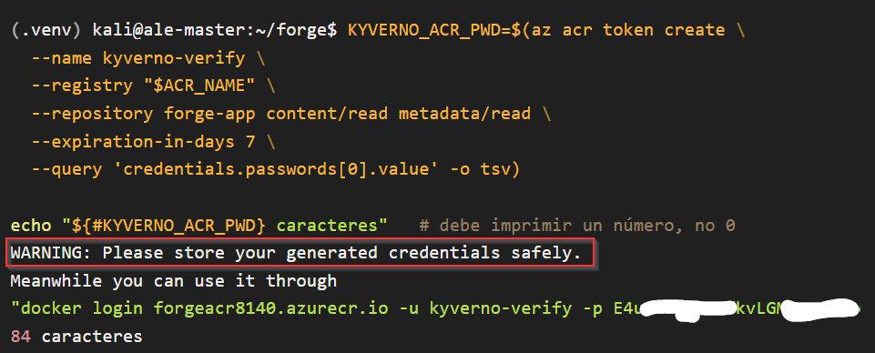
*The Azure CLI prints the token password to stderr, bypassing --query — it leaked into the session log. Because the credential is scoped (read-only, one repo, 7 days), the blast radius was minimal. Least privilege doesn't prevent leaks; it caps their cost.*

---

## 2 · Installing the gate (version-pinned)

```bash
# Pin the chart version explicitly — do not let Helm resolve "latest".
helm install kyverno kyverno/kyverno \
  --version 3.8.2 \          # matched to this cluster's Kubernetes version
  --namespace kyverno --create-namespace --wait
```

**What it does and why it matters.** Kyverno installs as a webhook wired into the API server's admission path. A version mismatch does not fail cleanly — it can install and then reject pods for reasons unrelated to signatures. Pinning the version is the same discipline as `FROM forge-base@sha256:…` in Phase 2: **nothing floats on `latest` inside the trust chain.**

> 🔐 **Security reading — the gate is now on the critical path.** Once Kyverno is a webhook, it can *break* deployments, not just inspect them. That power is the whole point (it's what lets it reject), but it means the component's own reliability is now a security property. This is why `failurePolicy` (Section 3) and the HA note (Risk management section) matter.

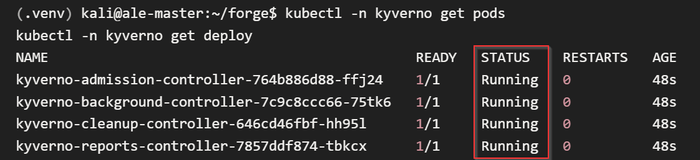

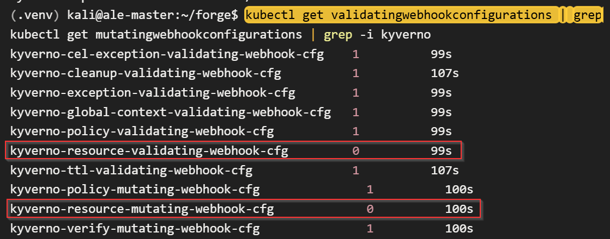
*Kyverno builds its webhooks from the policies you apply. With no policy yet, the two `kyverno-resource-*` webhooks — the ones that intercept pods — sit at `0`: the API server doesn't call Kyverno for any workload. Applying the policy (next section) flips them to `1`, scoped to ns/forge alone.*

---

## 3 · The policy — the core of the phase

This is the artifact everything else exists to support. Its structure maps one-to-one onto the guarantees it makes:

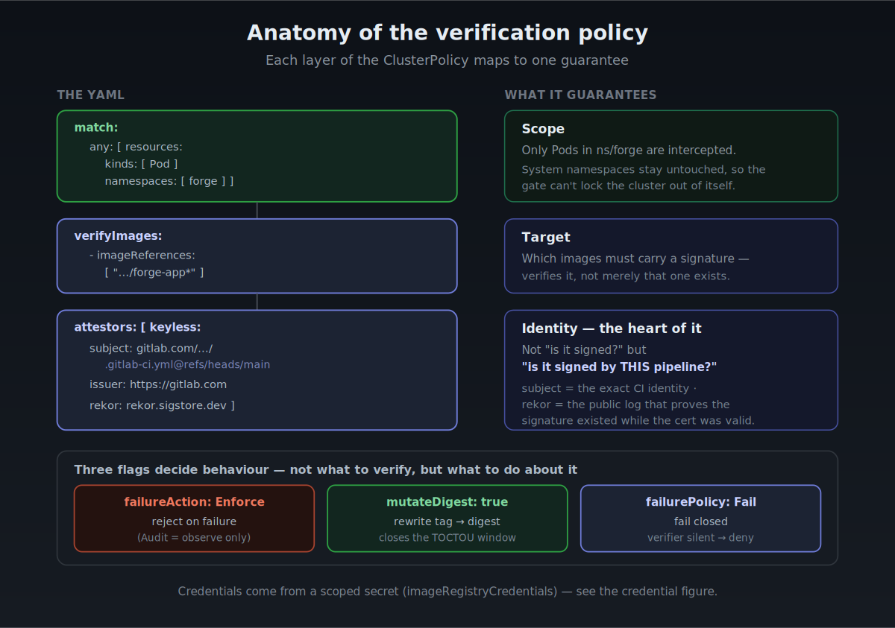

```yaml
apiVersion: kyverno.io/v1
kind: ClusterPolicy
metadata:
  name: verify-forge-app-signature
spec:
  webhookTimeoutSeconds: 30      # verification makes network calls (Fulcio/Rekor) — give it room
  failurePolicy: Fail            # 🛡️ if the verifier is unreachable, DENY — fail closed, never open
  rules:
    - name: verify-keyless-signature
      match:
        any:
          - resources:
              kinds: [Pod]
              namespaces: [forge]     # 🛡️ scope: only this namespace, so system pods can't be locked out
      verifyImages:
        - imageReferences:
            - "forgeacr8140.azurecr.io/forge-app*"   # which images this rule governs
          failureAction: Enforce      # 🛡️ Enforce = reject on failure (Audit = observe only)
          mutateDigest: true          # 🛡️ rewrite the verified tag to its digest (closes TOCTOU)
          verifyDigest: false         # 🛡️ don't require the manifest to already name a digest —
                                      #    let it use a readable tag; Kyverno resolves+pins it (see §5 note)
          imageRegistryCredentials:
            secrets: [acr-kyverno-creds]   # the scoped token from Section 1
          attestors:
            - entries:
                - keyless:
                    # 🛡️ THE HEART: not "is it signed?" but "is it signed by THIS identity?"
                    subject: "https://gitlab.com/alejandrochuang/forge-app//.gitlab-ci.yml@refs/heads/main"
                    issuer: "https://gitlab.com"
                    rekor:
                      url: https://rekor.sigstore.dev   # the public transparency log
```

> **The three behaviour flags — what to *do*, not what to *verify*:**
> - **`failureAction: Enforce`** — reject the request if verification fails. In `Audit` it would only record a violation and let the pod through.
> - **`mutateDigest: true`** after verifying, rewrite the image in the **pod spec** from the tag it was written with to the verified digest (`forge-app:0.1.0` → `forge-app:0.1.0@sha256:…`), so the pod is bound to the exact bytes that were checked, not to a movable tag. *(Mechanism and the TOCTOU gap it closes: Section 5.)
> - **`verifyDigest: false`** — do *not* require the manifest to already name a digest. This lets the Deployment reference a readable tag; Kyverno resolves and pins it. (This flag cost a debugging cycle — see Section 5's note.)
> - **`failurePolicy: Fail`** — a cluster-level switch: if Kyverno itself can't be reached, deny the request.

**What it does and why it matters.** The policy encodes the entire trust decision declaratively. `match` bounds *where* it applies; `verifyImages` bounds *which images*; `attestors.keyless` bounds *whose signature counts*. Change any one and you've changed the security posture in a reviewable, version-controlled way.

> 🔐 **Security reading — identity is the real control, not the signature.** The security does not come from "a signature exists." It comes from `subject` + `issuer` matching *one specific* CI identity. This is what makes the difference visible in 6: `python:3.11-slim` carries a perfectly valid signature (Docker's) and is still rejected, because it isn't *this* pipeline. Trust is anchored to *who signs*, verified against Rekor — not to possession of a key that could be stolen.

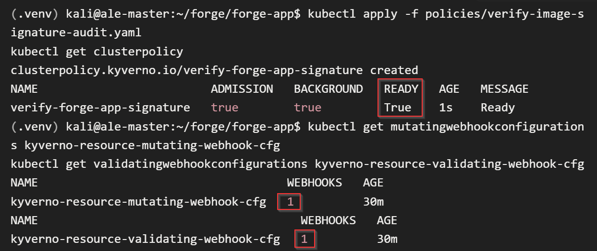
*The `0 → 1` transition is the gate coming online. The same `kyverno-resource-*` webhooks that sat at `0` in Section 2 now show `1`: from here the API server consults Kyverno for pods in ns/forge — and nothing else.*

---

## 4 · The safe rollout: Audit → Enforce

**The problem.** A blocking policy applied cold can reject *your own* signed app if anything is subtly wrong (a mistyped subject, an unreadable registry). You do not find that out in production.

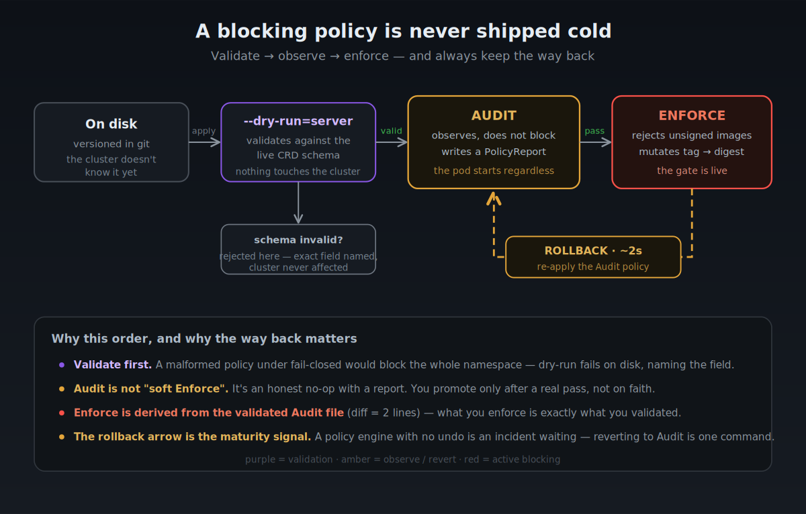

```bash
# Derive the Enforce policy FROM the validated Audit one — never hand-write it twice.
# The only differences are the two behaviour flags; the diff is exactly two lines.
sed -e 's/failureAction: Audit/failureAction: Enforce/' \
    -e 's/mutateDigest: false/mutateDigest: true/' \
  policies/verify-image-signature-audit.yaml > policies/verify-image-signature.yaml

# Validate against the LIVE CRD schema before touching the cluster.
# A malformed policy fails here, on disk, naming the exact field — not in production.
kubectl apply --dry-run=server -f policies/verify-image-signature.yaml
```

> **Audit is not "soft Enforce."** In `Audit`, Kyverno evaluates and writes a `PolicyReport`, but the pod starts regardless — an honest no-op with a report. You promote to `Enforce` only *after* the report shows a `pass` on your real, signed image. And the way back is one `kubectl apply` of the Audit file (~2s).

**What it does and why it matters.** Deriving Enforce from the validated Audit policy guarantees that *what you enforce is exactly what you validated* — the two-line diff is auditable. The `--dry-run=server` step validates against the CRD actually installed in the cluster, not against documentation that may be stale.

> 🔐 **Security reading — operational maturity is a security property.** The rollback arrow in the diagram is the part that separates "I can use Kyverno" from "I can operate an admission gate in production." A policy engine with no tested path back is an availability incident waiting to happen — and an availability incident in a fail-closed gate means *nothing deploys*. Safe rollout is not bureaucracy; it's how you avoid taking the platform down with a security control.

Under Audit, Kyverno records its verdict without blocking — the pod starts regardless. A `pass` on the signed image is the green light to promote:

```console
$ kubectl -n forge get policyreport -o wide
NAME       KIND         NAME                             PASS  FAIL  WARN  ERROR  SKIP
...        ReplicaSet   securityscanservice-8658dffb99    1     0     0      0      0
...        Deployment   securityscanservice               1     0     0      0      0
...        Pod          securityscanservice-8658dffb99…   1     0     0      0      0

$ kubectl -n forge get policyreport -o json \
    | jq -r '.items[].results[] | "\(.result)  \(.rule)  \(.message)"'
pass  verify-keyless-signature  verified image signatures for …/forge-app:0.1.0
```
*Audit is a no-op with a report — the pod (`securityscanservice`, Running) is admitted either way. This `pass`, evaluated across Pod, ReplicaSet and Deployment, is the evidence that authorises promotion to Enforce.*

---

## 5 · The invisible guarantee: tag → digest mutation

**The problem.** Between "I verified the tag `:0.1.0`" and "the container runtime pulls it," the tag could be re-pointed to different bytes (a classic time-of-check / time-of-use gap). Verifying a *tag* isn't enough if the tag is mutable.

This is the phase's most important idea, and it needs a sequence diagram to land, because the key fact is *temporal*:

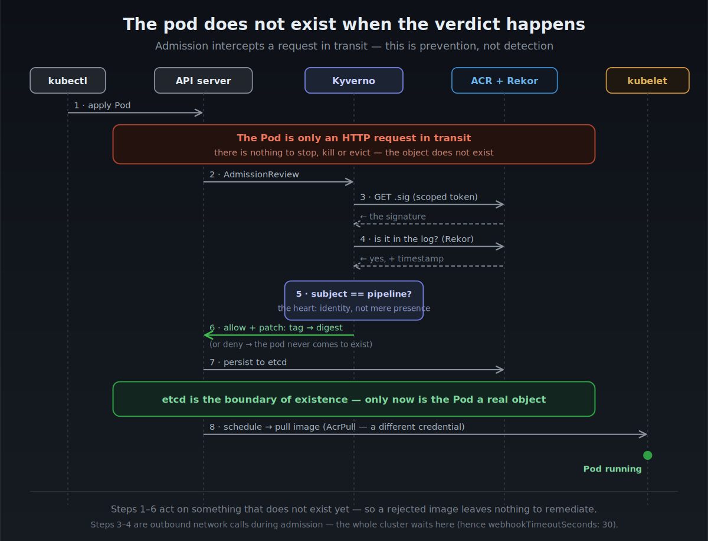

**What it does and why it matters.** Kyverno rewrites the image in the pod spec after verifying. The pod no longer requests a movable label; it requests the exact content hash that was checked. The tag stays as a human-readable label, but the runtime resolves by digest.

```console
$ kubectl -n forge get deployment securityscanservice \
    -o jsonpath='{.spec.template.spec.containers[0].image}'
forgeacr8140.azurecr.io/forge-app:0.1.0

$ kubectl -n forge get pods \
    -o jsonpath='{.items[*].spec.containers[*].image}'
forgeacr8140.azurecr.io/forge-app:0.1.0@sha256:933105a6…
```
*The Deployment asks for a mutable tag; the pod runs the verified digest — Kyverno rewrote the spec at admission.*

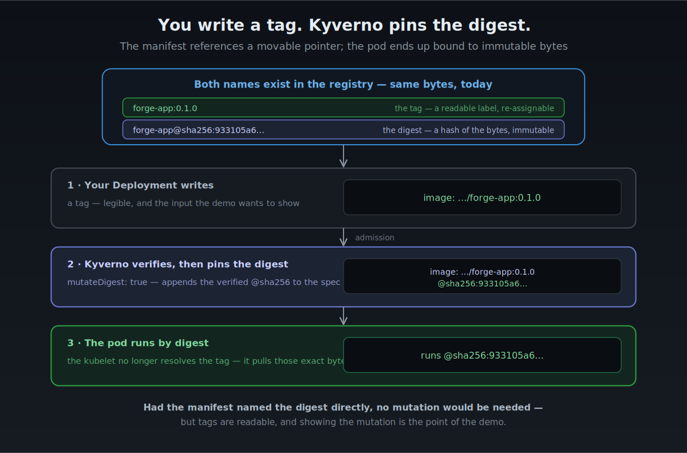
*Both names live in the registry. Your Deployment references the readable tag; Kyverno appends the verified digest at admission; the pod runs by digest. Had the manifest named the digest directly, no mutation would be needed — but tags are readable, and showing the mutation is the point of the demo.*

> **Why does Kyverno rewrite the pod's image?** A tag is a *pointer*, not the image
> itself. Normally the kubelet resolves `:0.1.0` to a digest **at start time** by asking
> the registry "what does this tag point to right now?" — so if someone re-points
> `:0.1.0` to different bytes after Kyverno verified it, the kubelet would happily run
> the new, unverified image. That gap between *check* and *run* is TOCTOU. With
> `mutateDigest: true`, Kyverno pins the digest it just verified straight into the pod
> spec — `forge-app:0.1.0` → `forge-app:0.1.0@sha256:933105a6…` — so the kubelet no
> longer resolves the tag: it pulls those exact bytes and nothing else. **Verify the
> tag, but run the digest.**

> 🔐 **Security reading — this closes the last seam in the chain.** Phases 1–2 pin the base by digest and sign by digest; this step extends that guarantee all the way to the running container. An attacker with registry write access can re-point `:0.1.0` to a malicious image, but it changes nothing: the admitted pod is bound to `sha256:933105a6…`, and that digest is the same one `cosign verify` checks from outside the cluster. The guarantee is not *declared* in a manifest — it is *imposed* at admission.

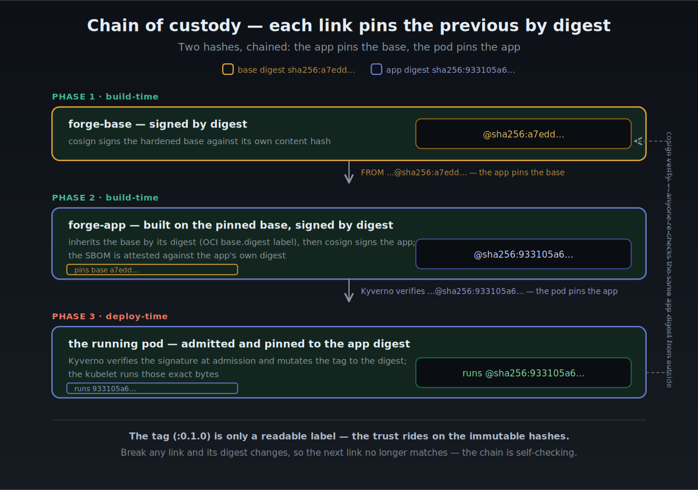
*Two hashes, chained. Phase 1 signs `forge-base` by its digest; Phase 2 builds `FROM …@sha256` — pinning the base — and signs `forge-app` by its own digest; Phase 3 verifies that digest and pins it into the running pod. `cosign verify` re-checks the same app digest from outside. Break any link and its digest changes, so the next link stops matching.*

**Chain of custody.** The mutation in this section isn't a local trick — it's the last link of a chain that runs from build-time to runtime. Trust doesn't travel on a single value but on a series of digests, each link cryptographically fixing the one before it: the app is built `FROM forge-base@sha256:…` (pinning the base), signed by its own digest, and the pod is admitted only against that app digest and then bound to it. The tag `:0.1.0` stays for a practical reason — a 64-character hash is miserable to type, read, or reference in a manifest — but it never carries the trust. It's a convenient sticker on the box; the custody seal is the hash underneath. And the chain is self-checking: change the bytes of any link and its digest changes, so the next link's pin no longer matches and nothing downstream verifies.


> 📝 **A debugging cycle worth remembering — the `verifyDigest` trap.**
> - **What happened:** the first promotion to Enforce rejected my *own signed app* with `missing digest`.
> - **Why:** `verifyDigest` defaults to `true`, which demands that *the manifest itself* already name a digest. My Deployment uses a tag (`:0.1.0`), so the autogenerated rule rejected it **before** the mutation could run.
> - **The fix:** set `verifyDigest: false` — stop requiring a hand-written digest, and let Kyverno resolve and pin it.
> - **Why it's safe:** `verifyDigest` is *not* a cryptographic control. It only decides *who* writes the digest (Kyverno at admission vs. the author in YAML). The signature is still verified, and the pod still runs by digest.
>
> ```text
> Enforce ON  →  verifyDigest=true demands a digest in the YAML
>             →  my YAML has a tag, not a digest
>             →  ❌ REJECTED ("missing digest") — my own signed app!
>             →  fix: verifyDigest=false
>             →  ✅ tag accepted, Kyverno mutates it to the digest
> ```


---

## 6 · The demo: the gate in action

The contrast **is** the proof. A gate that admits everything and a gate that doesn't exist look identical — you only know it works when you watch it turn something away.

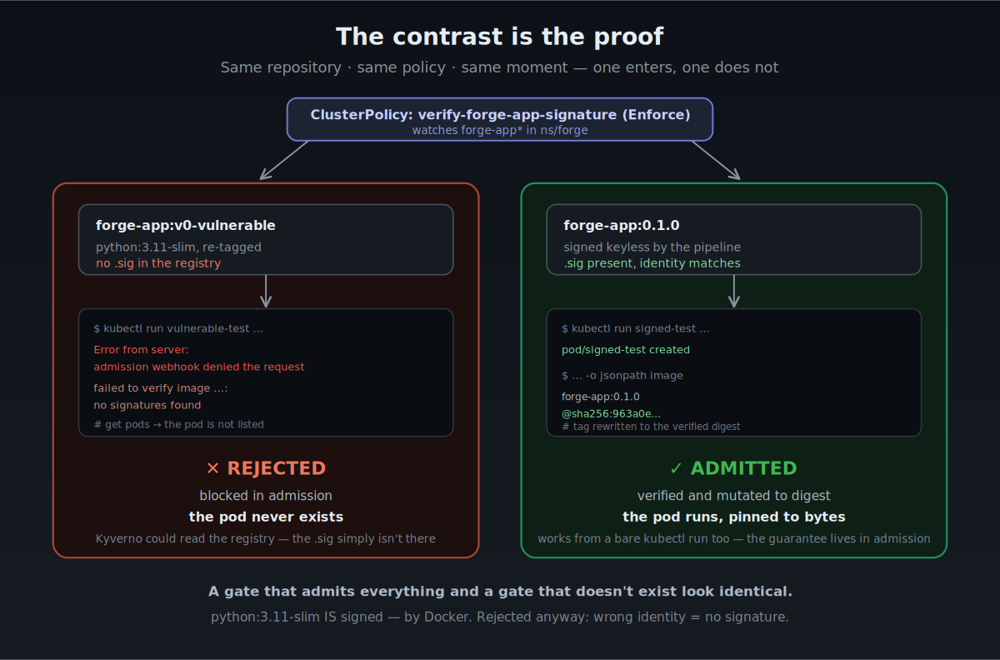

**What it does and why it matters.** The unsigned image is blocked *in admission* — `get pods` doesn't show it as `Failed` or `Pending`; it simply isn't there. Nothing to remediate, no runtime window, no forensics. The signed image, under the identical policy, is admitted and pinned to its digest.

> 🔐 **Security reading — the error message tells you the gate is healthy, not broken.** [...intacto...]

Two `kubectl run` commands make the gate observable. The first deploys the **unsigned** image (`v0-vulnerable`, tagged on purpose to fall under the watched `forge-app*` pattern); the second lists the pods to check what actually made it in:

```bash
kubectl -n forge run vulnerable-test \
  --image="$ACR_LOGIN_SERVER/forge-app:v0-vulnreable" --restart=Never
kubectl -n forge get pods
```

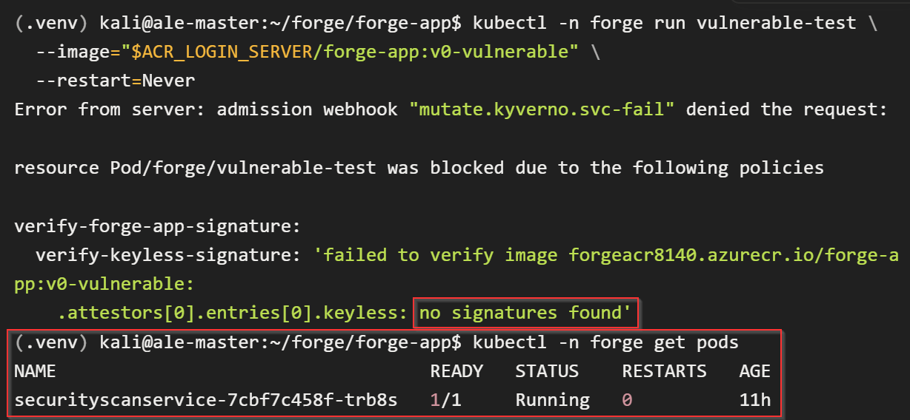

*The `run` request is denied at admission — `mutate.kyverno.svc-fail` blocks the Pod because `verify-keyless-signature` finds `no signatures found` for those bytes. The follow-up `get pods` confirms the outcome: only `securityscanservice` (the signed app) is listed — `vulnerable-test` never existed. `no signatures found`, not `UNAUTHORIZED`, means Kyverno could read the registry and correctly found no signature: the gate is working, not misconfigured.*

---

## 7 · When it got real: a CVE published *after* the build

This is the part no runbook scripts, and the part I learned the most from.

`forge-app` was built, scanned clean, signed, and deployed. Two weeks later — without touching a single line of code — a routine push turned the pipeline red.

### The sequence

```text
Day 0   forge-base built with python-3.11.15-r7
        Trivy scans it. CVE-2026-11940 has no upstream patch yet.
        Gate policy: --ignore-unfixed → block only CVEs that HAVE a patch.
        → nothing actionable → ✅ passes, legitimately

        ⏳  ~1 week passes. The image does not change.

Day 7  Chainguard/Wolfi publishes python-3.11.15-r8, which patches CVE-2026-11940.
        I push forge-app (wiring up the Kyverno chain). Trivy re-scans.
        Now r8 exists → the r7 finding is ACTIONABLE.
        → --ignore-unfixed no longer excuses it → ❌ pipeline blocked
```

**Same bytes, different verdict.** Nothing in the image changed — the *world* did. The vulnerability database learned about a flaw in the exact Python the base was frozen on, and a finding that was *unfixable* on Day 0 became *actionable* on Day 14.

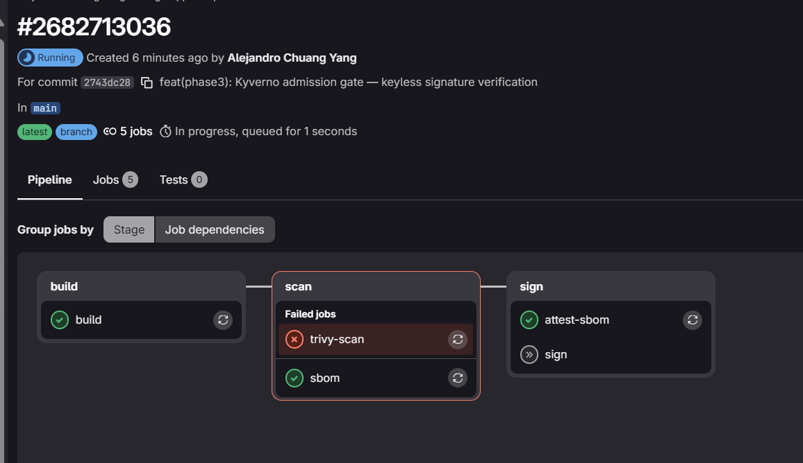
*The `forge-app` pipeline: Trivy scans the final app image and flags the `python-r7` inherited from the base. Note `attest-sbom` green while `trivy-scan` is red — the finding is actionable now that r8 exists.*

### Root cause

The CVE was not in the app or its 16 hash-pinned dependencies (`0` there). It lived in the base OS `python`, inherited through `FROM forge-base@sha256:…`.

The gate did the right thing **both times**. On Day 0, Trivy is run with `--ignore-unfixed` — a HIGH with no upstream patch isn't actionable, so it doesn't break the build. On Day 7 a patch existed, so the same flag no longer excused it and `--exit-code 1` blocked. **The digest pin that protects against image substitution is the same pin that freezes you on yesterday's Python** — precisely the residual risk *documented in Phase 2* (*"digest pinning is manual"*), collecting its invoice.

### The fix — at the source, not silenced

The fix touched **two repos**, in order — because the vulnerable `python` lived in the base, not the app:

1. **`forge-images`** — rebuild `forge-base`. The Dockerfile didn't change; a fresh `apk` resolve simply pulls `python-3.11.15-r8` instead of `r7`. This produces a new, signed base image with a new digest.
2. **`forge-app`** — bump the pinned base digest so the app inherits the fixed base:

```bash
# Point FROM (and the OCI base.digest label) at the newly-built base:
sed -i -E "s|sha256:[a-f0-9]{64}|${BASE_DIGEST}|g" Dockerfile
```
Pushing `forge-app` re-runs its pipeline: Trivy now scans an image built on `r8`, finds nothing actionable, and the chain goes green.

> **Fix over exception.** The CVE was *not* added to `.trivyignore`. A patch existed upstream, so silencing it would have been assuming risk out of laziness. Exceptions are for risks with *no* fix available (like the two HIGH findings in the bundled trivy binary, from Phase 1) — not for the ones you simply haven't applied yet.

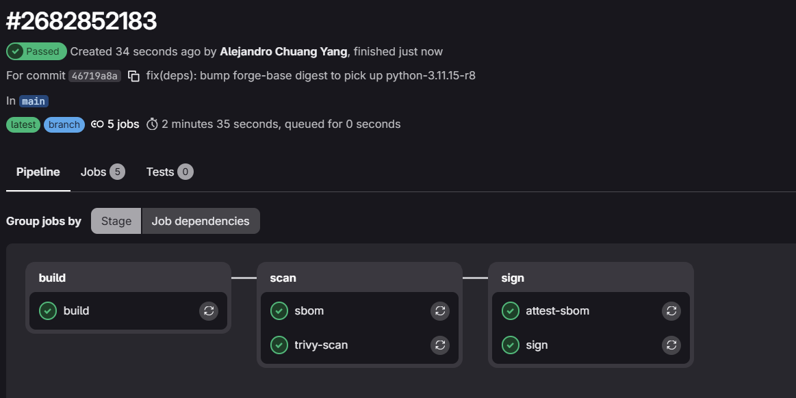
*Green earned, not silenced: the CVE fixed at the source — base rebuild + digest bump.*

> 🔐 **Security reading — the lesson that generalises.** A green scan is a **photograph, not a contract**: it certifies the world on scan day, against that day's vulnerability database. The artifact never changed — the world did. A build-time gate cannot catch a CVE that is published after the build. → Production needs **continuous re-scanning** of deployed images against fresh CVE data (the signed SBOM from Phase 2 is exactly what makes that a one-query answer), not a check that expires the moment the pipeline goes green.

<details>
<summary>Two smaller findings the red pipeline surfaced</summary>

- **`needs:` can silently bypass a gate.** The `attest-sbom` job declared `needs: [build]` only; in GitLab, `needs:` replaces stage ordering with an explicit dependency graph, so it ran *around* the Trivy gate and attested an image the gate had rejected (a `.att` with no matching `.sig`). The fix is to list the gate itself as a dependency:

```yaml
  attest-sbom:
    needs:
      - job: build
      - job: trivy-scan     # the gate — attest-sbom now can't run unless Trivy passed
      - job: sbom
```

  Proven by the very next blocked build (`6e96ea38` above): with the fix in place, Trivy stopped it and `attest-sbom` left *nothing* behind — no orphan `.att`. Only ever visible because a gate finally fired.

- **The registry became a forensic record.** The failed builds left their traces — an orphan `.att`, an absent digest, and the final signed pair — all readable straight from `az acr repository show-tags`.

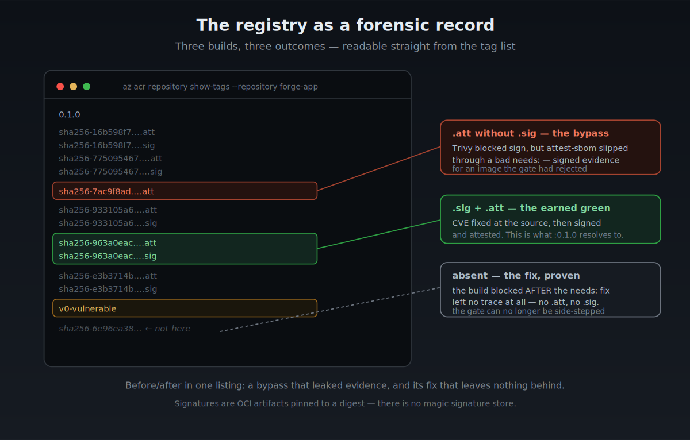
**Reading the tag list, three builds tell the story:**

- `7ac9f8ad….att` **with no `.sig`** — a build Trivy blocked *while the bug was live*. `sign` stopped, but `attest-sbom` slipped past and left an orphan attestation: the bypass.
- `6e96ea38…` **absent entirely** — a build Trivy blocked *after* the `needs:` fix. This time `attest-sbom` couldn't run around the gate, so it left nothing at all — no `.sig`, no `.att`. The absence *is* the proof the bypass is closed.
- `963a0eac….sig` + `.att` — the earned green: verified, signed, and attested, in the right order.

</details>


---

## Risk management (what was *not* fixed)

An honest model beats an all-green one. A portfolio claiming zero risk isn't credible — maturity is knowing *exactly* what you didn't solve, why, and what production would do instead. Residual risk, identified and documented:

> 🟡 **residual risk** — something production would fix, but consciously accepted in the lab (with the mitigation noted).
> 🔵 **out of scope** — not a flaw, but a concern that belongs to a different layer or project.

- 🟡 **The policy watches `forge-app*` only** — an unrelated image (`nginx:latest`) could enter `ns/forge` unverified. Production: a companion rule requiring a trusted registry + signature for *all* images, with an explicit allowlist rather than a watched name pattern.

- 🟡 **The 7-day verifier token is an availability time bomb** — on expiry, `failurePolicy: Fail` turns the security gate into an outage for the namespace. Production: **Azure Workload Identity** for Kyverno — federated OIDC, no password to rotate. The same principle as keyless signing: *the best secret is one that doesn't exist.* (This phase alone hit three expired-credential incidents — an `az acr login` token thrice, and a Service Principal secret rotated in one repo but not the other.)

- 🟡 **The registry credential lives as a base64 Secret in etcd** — that is encoding, not encryption; it isn't encrypted at rest by default. Production: enable etcd encryption-at-rest, or avoid the stored secret entirely with Workload Identity (which also solves the expiry above).

- 🟡 **`kubectl delete clusterpolicy` disarms the gate silently** — the webhooks drop back to `0`, with no alert and no trace. Production: strict RBAC on `clusterpolicies`, GitOps reconciliation (the repo is the source of truth), and an alert on `WEBHOOKS == 0`.

- 🟡 **Single admission-controller replica (no HA)** — deliberate on a 2-vCPU lab node; production runs 3 replicas, because with fail-closed a crashed verifier stops *all* admissions.

- 🟡 **Sigstore public-infrastructure dependency** — verification needs egress to Rekor/TUF; production mitigation: a self-hosted Sigstore, carried over from Phase 1.

- 🔵 **Admission does not re-evaluate running pods** — the gate governs what *enters*, not what *is*. A pod admitted yesterday keeps running even if its image is later found vulnerable. Runtime security (eBPF/Tetragon) is a different layer, and a later project.

---

## Verify it yourself

The identity the gate enforces is the same one anyone can check from outside the cluster:

```bash
cosign verify \
  --certificate-identity-regexp "https://gitlab.com/alejandrochuang/forge-app//.gitlab-ci.yml.*" \
  --certificate-oidc-issuer "https://gitlab.com" \
  "$ACR_LOGIN_SERVER/forge-app@$APP_DIGEST" \
  | jq '.[0].optional.Subject, .[0].optional.Issuer'
```

## Stack

`Kyverno v1.18` (chart 3.8.2, version-pinned) · `cosign` / `Sigstore` (Fulcio + Rekor, keyless) · `ACR` scoped tokens (repository-level RBAC) · `AKS` · `Helm` · `kubectl` (`--dry-run=server` against live CRDs) · policies-as-code versioned with the app

## Repository layout (Phase 3 additions)

```text
forge-app/
├── k8s/
│   ├── namespace.yaml                      # ns/forge — the gate's scope boundary
│   ├── deployment.yaml                     # hardened securityContext; image BY TAG (demo input)
│   └── service.yaml                        # ClusterIP, no public exposure
├── policies/
│   ├── verify-image-signature-audit.yaml   # source of truth — validated first
│   └── verify-image-signature.yaml         # DERIVED from audit (diff = 2 lines)
└── docs/img/                               # figures and evidence for this README
```

## Project context

**Phase 0** (`forge-infra`): Azure foundations with Terraform — AKS, ACR, Workload Identity, remote state, Checkov IaC scanning. ✅
**Phase 1** (`forge-images`): hardened, signed golden base image (Wolfi, Trivy gate, keyless cosign). ✅
**Phase 2** (`forge-app`): signed application supply chain — hash-pinned deps, SBOM + provenance, keyless signature. ✅
**Phase 3** (this work): **admission control** — the cluster rejects any image not signed by the expected pipeline identity. The chain is closed end to end: *build securely → sign → deploy only what verifies.* ✅
