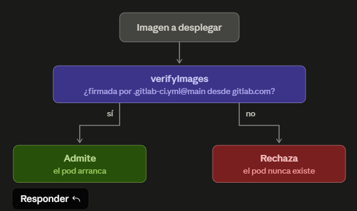
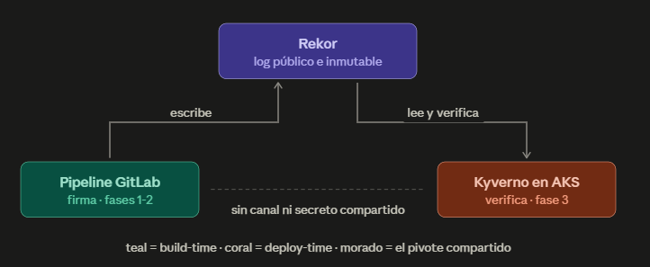
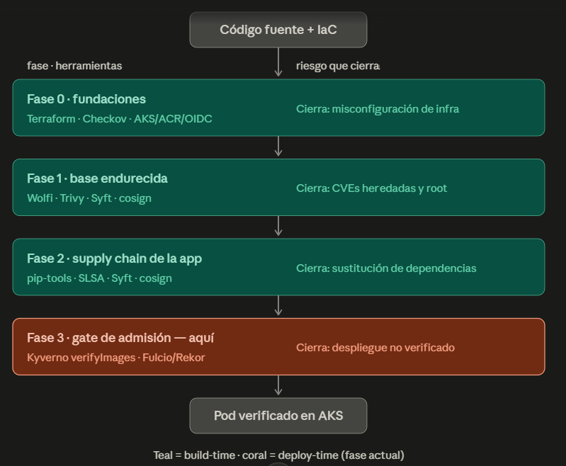
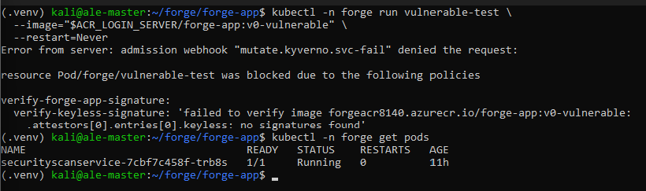
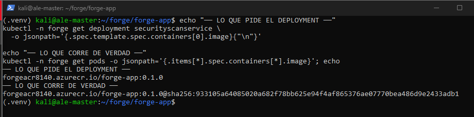
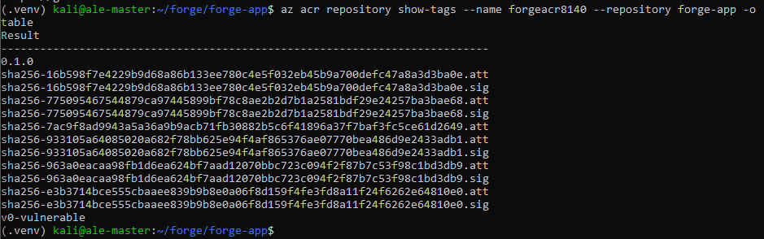

# forge-app · Phase 3 — Admission gate: the cluster enforces the signature

**Deploy-time trust, enforced:** Kyverno as an admission controller on AKS, verifying **keyless signatures against the exact pipeline identity** that built the image (Fulcio + Rekor) — before the pod exists. Signed image admitted and **pinned to its verified digest**; unsigned image rejected, **the pod never comes into being**.

> **The 10-second version:** Phases 1–2 produced cryptographic evidence — this phase makes the cluster **demand it**. A `verifyImages` policy rolled out Audit → Enforce admits only images signed by `gitlab.com/alejandrochuang/forge-app//.gitlab-ci.yml@refs/heads/main`, mutates every tag to its verified digest (closing the TOCTOU window), and actively rejects everything else. The difference between *"I have a signature"* and *"my platform requires one."*

<!-- 📷 HERO — decision diagram: verifyImages → admit / reject (image_3: "¿firmada por .gitlab-ci.yml@main?") -->


---

## Why this matters

Everything before this phase is **passive evidence**. Trivy, Syft and cosign produce proof — none of them *prevents* anything. An attacker with cluster access could still deploy any image; the signatures would sit in the registry, unread.

Admission control is the link that **exercises** the evidence: Kubernetes asks Kyverno *before* scheduling every pod, and Kyverno cryptographically verifies — against Fulcio/Rekor, with the pipeline's OIDC identity, not a stored public key — that the image is exactly what the pipeline built and signed. Verification isn't a step someone remembers to run. **It's the platform's default.**

## Key results

| Dimension | Industry default | `forge` (after this phase) |
|---|---|---|
| Deploy-time verification | none — signatures unread | **keyless `verifyImages` in admission**, identity-pinned |
| What is trusted | *a* signature exists | signed by **this exact pipeline** (subject + issuer) |
| Image reference at runtime | mutable tag | **mutated to verified digest** at admission (TOCTOU closed) |
| Unsigned image | deploys silently | **rejected — the pod never exists** |
| Policy rollout | Enforce cold | **Audit → Enforce**, promoted on PolicyReport evidence |
| Verifier credential | admin creds / cluster-wide SP | **ACR scoped token: read-only, 1 repo, 7 days** |
| Verifier failure mode | fail open | **fail closed** (`failurePolicy: Fail`) |

---

## Architecture

Two independent trust domains that never share a secret. The pipeline signs at build time; the cluster verifies at deploy time; **Rekor is the only shared component** — a public, immutable fact instead of a distributed credential.

<!-- 📷 Rekor as the pivot (image_2: pipeline escribe → Rekor ← Kyverno lee y verifica, "sin canal ni secreto compartido") -->


The admission sequence — the part no static diagram can show — is that **the pod does not exist yet** when the verdict happens:

```text
 kubectl        API server        Kyverno           ACR + Rekor        kubelet
    │                │               │                   │                │
    ├── apply Pod ──▶│               │                   │                │
    │                │  ⚠ the Pod is an HTTP request in transit —        │
    │                │    there is nothing to stop, kill or evict        │
    │                ├─ Admission ──▶│                   │                │
    │                │               ├── read .sig ─────▶│  (scoped token)│
    │                │               ├── in the log? ───▶│  (Rekor)       │
    │                │               │  subject == pipeline identity?     │
    │                │◀── allow + patch tag→digest ──────┤                │
    │                │       — or deny: pod never exists —                │
    │                ├─ persist ─▶ etcd ── schedule ─────────────────────▶│
    │◀── created ────┤               │                   │             🟢 Pod
```

Prevention, not detection: a rejected image leaves nothing to remediate, no forensics, no runtime window.

<!-- 📷 Phase chain for context (image_1: fases 0-3, teal build-time / coral deploy-time) -->


## The gate in action

The contrast **is** the proof — a gate that admits everything and a gate that doesn't exist look identical. Same repository, same policy, same instant:

```console
$ kubectl -n forge run vulnerable-test --image=$ACR/forge-app:v0-vulnerable --restart=Never
Error from server: admission webhook "mutate.kyverno.svc-fail" denied the request:
  verify-keyless-signature: 'failed to verify image ...forge-app:v0-vulnerable:
    .attestors[0].entries[0].keyless: no signatures found'

$ kubectl -n forge run signed-test --image=$ACR/forge-app:0.1.0 --restart=Never
pod/signed-test created
$ kubectl -n forge get pod signed-test -o jsonpath='{.spec.containers[0].image}'
forge-app:0.1.0@sha256:933105a6…        ← admitted AND pinned to the verified digest
```

<!-- 📷 forge-p3-10b-gate-rechaza.png — the rejection + get pods showing the pod does not exist -->


<!-- 📷 forge-p3-09c-mutacion-digest.png — Deployment asks for a tag, the Pod runs a digest -->


The unsigned contrast image is `python:3.11-slim` — the *industry default* from the Phase 1/2 comparison tables (~20 inherited CVEs, runs as root, no signature), deliberately pushed under the watched name `forge-app:v0-vulnerable`. **The industry default, wearing my app's name, is rejected by my cluster.** Full circle with the project's first decision.

### Verify it yourself

The identity Kyverno enforces is the same one anyone can check from outside the cluster:

```bash
cosign verify \
  --certificate-identity-regexp "https://gitlab.com/alejandrochuang/forge-app//.gitlab-ci.yml.*" \
  --certificate-oidc-issuer "https://gitlab.com" \
  "$ACR_LOGIN_SERVER/forge-app@$APP_DIGEST" | jq '.[0].optional.Subject'
```

---

## Engineering decisions (the *why*, not just the *what*)

**Verify *who* signed, not *that* something is signed.** The policy pins `subject` + `issuer` to the exact pipeline identity, extracted from the real Phase 2 signature (`cosign verify`), never from documentation — one divergent character and the gate rejects its own image with an error identical to a legitimate denial. Notably, `python:3.11-slim` *is* signed (by Docker) and was still rejected: **wrong identity is the same as no signature.**

**Audit → Enforce, with the Enforce policy *derived*, not rewritten.** A blocking policy never ships cold: Audit observes and writes PolicyReports while pods still start; only a `pass` verdict promotes it. The Enforce version is generated from the validated Audit file with `sed` — the `diff` is exactly two lines (`failureAction`, `mutateDigest`), guaranteeing what was validated is what gets enforced. Rollback is one `kubectl apply` away (~2s).

**Least privilege for the verifier.** Kyverno uses its own OCI client — the node's `AcrPull` managed identity does not apply — so it received an **ACR scoped token: `content/read` on one repository, 7-day expiry**, not the CI Service Principal. Field-tested the same day: the Azure CLI leaked the token password to stderr; blast radius was *one repo, read-only, one week*. **Least privilege doesn't prevent leaks — it caps what they cost.** *(The checker of the door doesn't need the keys to the building.)*

**`verifyDigest: false` + `mutateDigest: true` — an honest trade-off.** `verifyDigest` is not a cryptographic control; it only demands that *you* hand-write digests in manifests, and it blocks tag-based Deployments before the mutation can act. Disabling it changes *who resolves the digest* (Kyverno at admission, instead of the author in YAML) — the signature is still verified and the pod still runs by digest. The stricter alternative (digests in manifests) would erase the very demo this phase exists to show.

**Fail closed, scoped small, recoverable.** `failurePolicy: Fail` — if the verifier is silent, deny. The policy matches only Pods in `ns/forge` (Kyverno rebuilds its webhooks *from the policies*: 0 rules → the API server doesn't even call it; apply the policy → exactly 1). And Kyverno's own namespace stays excluded from its webhooks — self-policing would make a crashed verifier unable to restart.

## Production debugging: making the gate converge

Triaged, one line each — the runbook was treated as a statement of intent, not a script, and four of its assumptions didn't survive contact with a real environment:

| Failure | Diagnosis → fix |
|---|---|
| Signed image would report `no matching signatures found` | ACR is private and Kyverno's OCI client has no node identity → **scoped ACR token** as `imageRegistryCredentials` (gap #1: the runbook assumes a readable registry) |
| `validationFailureAction` silently deprecated | Live schema wins: `failureAction` inside `verifyImages`, validated with `kubectl apply --dry-run=server` against the installed CRD (gap #2) |
| `mutateDigest must be false for 'Audit'` | Audit is an honest no-op — mutating *is* acting; Kyverno's own admission policy rejected the policy (meta, and correct) |
| Enforce blocked the *signed* Deployment: `missing digest` | `verifyDigest` (default `true`) denies tag references before mutation can run → `verifyDigest: false` (gap #3: the runbook's own §9 blocks itself) |
| `rollout status` reported success on a **blocked** restart | It was describing the *old* pod; the real signal is `old replicas are pending termination` |

## The incident that closed the loop: a CVE arrived *after* the build

Days after `forge-app` was built, scanned green, signed and deployed, **Wolfi published `python-3.11.15-r8`, fixing `CVE-2026-11940`** (HIGH, `tarfile.extractall()` filter bypass). A routine push turned the pipeline red: **same bytes, different verdict.** The vulnerability wasn't in the app or its 16 hash-pinned dependencies — it lived in the base OS, inherited through `FROM forge-base@sha256:…`. The digest pin that protects against image substitution is the same pin that freezes you on yesterday's Python: **the exact residual risk documented in Phase 2** (*"digest pinning is manual"*), collecting its invoice.

Resolution followed the project's own rule — *fix > except, in that order*: rebuild `forge-base` (pulls `r8`), verify the new base signature, bump the pinned digest **and** the OCI `base.digest` label in `forge-app`, green pipeline. No `.trivyignore` entry: a patch existed, so an exception would have been assumed risk out of laziness.

<!-- 📷 forge-p3-x3-pipeline-verde.png — the earned green: 5/5 jobs after fixing at the source -->


The red pipeline surfaced three findings a green one never would:

- 🔎 **`needs:` silently bypasses gates.** `attest-sbom` declared `needs: [build]` — in GitLab, `needs` replaces stage ordering with a DAG, so it ran *around* the Trivy gate and **signed an attestation for a rejected image** (an `.att` with no `.sig` in the registry). Fix: every job that emits signed evidence declares the gate as an explicit dependency. Only visible when a gate actually fires.
- 🔎 **TOCTOU absorbed, live.** The failed build re-pointed `:0.1.0` to an unsigned image — and nothing happened: the running pod was **pinned to its verified digest** by Kyverno's mutation, and any new rollout would have been rejected by the gate. The attack Phase 2 argues about, observed and neutralized without human action.
- 🔎 **A green scan is a photograph, not a contract.** It certifies the world *on scan day*. The artifact didn't change — the world did, and only a coincidental push revealed it. Production needs **continuous SBOM re-scanning against new CVEs**, not a build check that expires the day it runs.

<!-- 📷 forge-p3-x4-cadena-restaurada.png — the registry as forensic record: .att without .sig (bypass), absent digest (fixed DAG), .sig+.att pair (earned green) -->


## Risk management (what was *not* fixed)

An honest model beats an all-green one. Residual risk, identified and documented:

- 🟡 **The policy watches `forge-app*` only** — an unrelated image (`nginx:latest`) enters `ns/forge` unverified. Production: a companion rule requiring a trusted registry + signature for *all* images, with an explicit allowlist instead of a watched pattern.
- 🟡 **The 7-day verifier token is an availability time bomb** — on expiry, fail-closed turns the security gate into an outage for the namespace. Production: **Azure Workload Identity** for Kyverno — federated OIDC, no password to rotate. The same principle as keyless signing: *the best secret is one that doesn't exist* (independently reinforced this phase by an expired `az acr login` ×3 and a Service Principal secret rotated in one repo but not the other).
- 🟡 **`kubectl delete clusterpolicy` disarms the gate silently** — webhooks drop to 0, no alert, no trace. Production: strict RBAC on `clusterpolicies`, GitOps reconciliation (the repo is the source of truth), alert on `WEBHOOKS == 0`.
- 🟡 **Single admission-controller replica** (no HA) — deliberate on a 2-vCPU lab node; production runs 3 replicas, because with fail-closed, a crashed verifier stops all admissions.
- 🟡 **Sigstore public infrastructure dependency** — verification needs egress to Rekor/TUF; production mitigation: self-hosted Sigstore, carried over from Phase 1.
- 🔵 **Admission does not re-evaluate running pods** — the gate governs what *enters*, not what *is*. Runtime security (eBPF/Tetragon) is a different layer and a later project.

## Stack

`Kyverno v1.18` (chart 3.8.2, version-pinned) · `cosign` / `Sigstore` (Fulcio + Rekor, keyless) · `ACR` scoped tokens (repository-level RBAC) · `AKS` · `Helm` · `kubectl` (`--dry-run=server` against live CRDs) · policies-as-code versioned with the app

## Repository layout (Phase 3 additions)

```text
forge-app/
├── k8s/
│   ├── namespace.yaml                      # ns/forge — the gate's scope boundary
│   ├── deployment.yaml                     # hardened securityContext, image BY TAG (demo input)
│   └── service.yaml                        # ClusterIP, no public exposure
├── policies/
│   ├── verify-image-signature-audit.yaml   # source of truth — validated first
│   └── verify-image-signature.yaml         # DERIVED from audit (diff = 2 lines)
└── Makefile                                # + kyverno-install / deploy / policy-audit / policy-enforce / demo-blocked
```

## Main commands

```bash
# The signing identity — extracted from the real signature, the policy's literal input
cosign verify --certificate-identity-regexp ".../forge-app//.gitlab-ci.yml.*" \
  --certificate-oidc-issuer "https://gitlab.com" "$ACR/forge-app@$DIGEST" \
  | jq -r '.[0].optional.Subject, .[0].optional.Issuer'

# Least-privilege verifier credential
az acr token create --name kyverno-verify --registry "$ACR_NAME" \
  --repository forge-app content/read metadata/read --expiration-in-days 7
kubectl create secret docker-registry acr-kyverno-creds -n kyverno ...

# Kyverno, version-pinned
helm install kyverno kyverno/kyverno --version 3.8.2 -n kyverno --create-namespace --wait

# Policy: validate against the LIVE schema, apply in Audit, read the verdict
kubectl apply --dry-run=server -f policies/verify-image-signature-audit.yaml
kubectl apply -f policies/verify-image-signature-audit.yaml
kubectl -n forge get policyreport -o json | jq -r '.items[].results[] | "\(.result) \(.message)"'

# Promote to Enforce (derived file), force pods through the gate
kubectl apply -f policies/verify-image-signature.yaml
kubectl -n forge rollout restart deployment/securityscanservice

# The demo
kubectl -n forge run vulnerable-test --image=$ACR/forge-app:v0-vulnerable --restart=Never  # denied
kubectl -n forge run signed-test     --image=$ACR/forge-app:0.1.0         --restart=Never  # created + digest-pinned

# Cost discipline: stop what's expensive, keep what's valuable
az aks stop -g forge-rg -n forge-aks --no-wait     # ACR stays — it holds the evidence
```

## Project context

**Phase 0** (`forge-infra`): Azure foundations with Terraform — AKS, ACR, Workload Identity, remote state, Checkov IaC scanning. ✅
**Phase 1** (`forge-images`): hardened, signed golden base image (Wolfi, Trivy gate, keyless cosign). ✅
**Phase 2** (`forge-app`): signed application supply chain — hash-pinned deps, SBOM + provenance, keyless signature. ✅
**Phase 3** (this work): **admission control** — the cluster rejects any image not signed by the expected pipeline identity. The chain is closed end to end: *build securely → sign → deploy only what verifies.* ✅
**Phase 4** (next): documentation — master README, threat model (which attack each link prevents), and the interview demo script.
